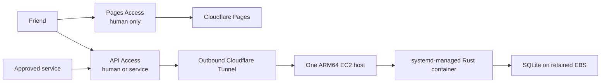

# Itinera — Design Document

Status: draft v1 · 2026-08-02 · author: Kaiyu Huang + Claude

Itinera is a collaborative trip planner for a small group of friends. A trip is a
multi-day route drawn on a map; the group proposes candidate places, votes on
changes through polls, discusses in threads, splits costs in a shared ledger, and
can let AI assistants participate through short-lived, scoped Cloudflare Access
service identities.

---

## 1. Guiding principles

1. **Everything behind an interface.** Every external dependency — maps, routing,
   email, database, object storage — is accessed through a Rust trait (backend) or
   TypeScript interface (frontend). Callers never import a vendor SDK directly.
   Swapping Google Maps for MapLibre/OSRM, or DynamoDB for another durable
   store, must not touch business logic.
2. **Two-tier governance, everything historied.** _Structural_ changes (anything
   that reshapes the route: add/remove/move stops or days) require a poll **or**
   a leader's approval. _Content_ edits (text, times, photos, bookings) apply
   immediately but are recorded in a field-level, revertible edit history.
   AI-originated changes of either kind are staged for the service owner's
   personal review before they enter the system at all.
3. **Optimize total cost, not only the cloud bill.** Prefer the smallest
   predictable deployment that is easy to understand and recover. A modest
   monthly instance bill is cheaper than maintaining a persistence design that
   multiplies application code. See §10 for the cost table.
4. **Phone-first viewing, laptop-first editing.** The people on the trip will
   mostly _read_ the plan on a phone; heavy editing happens beforehand on a laptop.

---

## 2. Architecture overview



- **One host, not a cluster.** One `t4g.micro` in one Availability Zone runs
  one ARM64 axum container. Host systemd owns its lifecycle. ECS, an ALB, and a
  second app node would add control planes without improving the accepted
  availability target.
- **Outbound tunnel instead of a public origin.** Cloudflare Access protects the
  API hostname and Cloudflare Tunnel carries accepted requests to host
  `cloudflared`, which proxies only to the container's loopback-published port.
  The instance has no public IPv4, SSH, inbound security-group rule, or public
  application listener. Its IPv6 default route uses an egress-only internet
  gateway. Rust still verifies every Access assertion and performs all
  application authorization. See
  [the trusted request journey](SECURITY.md#the-journey-of-a-trusted-request).
- **Database: one local SQLite file.** SQLite runs in WAL mode on a dedicated,
  encrypted, retained gp3 EBS data volume. Foreign keys and unique constraints
  replace mirrored claims where possible. Every trip-owned mutation uses one
  `BEGIN IMMEDIATE` transaction that rechecks direct membership and role before
  changing domain, audit, or idempotency rows. First login, trip creation,
  invitation acceptance, and owner-scoped service management instead use their
  explicit verified-principal transaction recipes. The physical schema and
  invariant mapping live in [`SQLITE.md`](SQLITE.md).
- **Deliberately modest availability.** A host or Availability Zone failure
  causes downtime. Daily portable online backups go to private versioned S3;
  recovery attaches the retained same-AZ volume or restores into a new volume.
  The initial RPO is 24 hours and RTO is 4 hours.

The accepted decision and alternatives are recorded in
[`adr/0001-single-node-sqlite.md`](adr/0001-single-node-sqlite.md). The
undeployed Lambda/DynamoDB backend was archived and removed before the SQLite
repository rewrite. No private environment or live production data exists;
there is no runtime dual-write period.

### 2.1 Ports (traits) — the swappability contract

```rust
// backend/crates/core/src/ports/
trait PlaceCatalog   { fn search(&self, q) -> …; fn details(&self, ref) -> …; fn photo_url(&self, ref) -> …; }
trait RoutingEngine  { fn leg(&self, from, to, mode, depart) -> Leg; fn matrix(&self, pts, mode) -> …; }
trait IdentityProvider { fn authenticate(&self, req) -> Identity;   // Cloudflare Access JWT adapter;
                         fn grant_login(&self, email) -> …;         // fallback adapter: self-hosted OTP + SES
                         fn revoke_login(&self, email) -> …; }      // grant/revoke = Access policy via CF API
trait Mailer         { fn send_digest(&self, …) -> …; }              // v2 only (digests/invites) — login needs no email from us
trait BlobStore      { fn put(&self, key, bytes) -> Url; }
trait FxRateProvider { fn rate_to_base(&self, currency, base_currency) -> Rate; }
trait Clock / IdGen  // deterministic tests

// repositories
trait TripRepo, PlanRepo, PollRepo, LedgerRepo, UserRepo, ServiceIdentityRepo, CommentRepo
```

Adapters: `adapter-gmaps` (implements `PlaceCatalog` + `RoutingEngine` with
Places API + Routes API), `adapter-cf-access`, `adapter-sqlite`, and `adapter-r2`.
The archived `adapter-dynamodb` is not part of the active rewrite; every SQLite
capability must pass its repository contract before runtime is restored once.

Provider-independent validity belongs in the domain. Aggregate fields are
private where an unchecked value could create an invalid object. Validated
newtypes such as `CurrencyCode`, `DateRange`, and `TripMember` carry their local
invariants; converting the single field representation `TripData` into its
transparent `Trip` wrapper checks the aggregate-wide member and leader rules.
`Trip::create` produces that same `Trip` type, so the repository does not impose
a creation-only one-member shape. `Invite::create` produces a `PendingInvite`
because pending is an actual lifecycle state. Persistence still owns schema
types, foreign keys, revisions, transaction-time authorization, capacity, and
encoded-size limits; stored data that cannot construct a valid domain value
maps to repository corruption rather than a client error.
The frontend mirrors this with a `MapRenderer` interface implemented by
`GoogleMapRenderer` (and later, potentially, `MapLibreRenderer`).

### 2.2 Repository layout (monorepo)

```
itinera/
├── backend/                 # Rust workspace
│   ├── crates/core/         # domain types, ports, services (no vendor deps)
│   ├── crates/adapters/     # SQLite, Cloudflare Access, gmaps, ses, r2
│   └── crates/api/          # axum routes, auth middleware, TCP container entrypoint
├── frontend/                # Vite + React + TypeScript
├── edge/                    # transitional Worker; removed after Tunnel cutover
├── infra/                   # Terraform *module* — values injected by the private deploy repo (§2.3)
└── docs/
```

### 2.3 Two repos: public app, private deploy

Everything that _is_ the app is public; everything that _points at a real
deployment_ is private.

- **`itinera` (public, this repo)** — application code, docs, the API
  contract, CI (application checks plus mocked infrastructure tests), and infra
  _code_: `infra/` is a backend-free Terraform child module. Real deployment
  values are required inputs rather than defaults. The workflow token is
  read-only and no secret or AWS credential is configured here. Public Actions
  logs are world-readable, so CI runs formatting, provider-schema validation,
  and mock-provider tests only—never an environment plan or apply.
- **`itinera-deploy` (private)** — the Terraform _root_ module: real
  `terraform.tfvars`, remote state backend config, GitHub environment
  secrets, deployment URLs, ops notes, and the deploy workflow, which checks
  out `itinera` at a pinned tag/commit, builds, and applies. Triggered
  manually (`workflow_dispatch` with a git ref) or on a release tag.

Which side of the line a value lands on:

| Public (`itinera`)                                          | Private (`itinera-deploy`)                                                    |
| ----------------------------------------------------------- | ----------------------------------------------------------------------------- |
| Terraform module code and resource naming rules             | `terraform.tfvars`: prefixes, account IDs, ARNs                               |
| IAM policies (least-privilege — they are a public map)      | custom domain, zone ID, Access hostname — anything that reveals the app's URL |
| Required input declarations with no real values             | deployment URLs, Tunnel/Access bindings, ops runbook                          |
| `.env.development` (`VITE_API_BASE_URL=http://localhost:…`) | production `VITE_API_BASE_URL`, injected at build time                        |
| —                                                           | short-lived GitHub OIDC role, Tunnel token, runtime secrets, backup identifiers |

Terraform **state lives in neither repo**. The private root uses an encrypted S3
backend with native locking (`use_lockfile = true`). Its separately bootstrapped
bucket has versioning and all public-access blocks enabled, and the OIDC deploy
role is scoped to the application state and lock objects. State contains every
resolved value and sometimes plaintext secrets, and public git history is
forever. The public child module therefore has no `backend` or `provider` block.
Its dependency lock makes public validation reproducible, while the private root
keeps the authoritative deployment lock file.

Note the two distinct boundaries. The split keeps real identifiers out of
public _source and logs_, but the deployed frontend bundle necessarily bakes
in the API base URL (`VITE_*` vars are substituted at build time), so anyone
who can load the app can read it. The actual security boundary is Cloudflare
Access in front of both the Pages site and the API (§6). They are separate
Access applications: Pages is human-only, while the API admits the same humans
plus explicitly named services. Both reference one reusable human-admission
group, so invite reconciliation changes one desired-state list; services and the
health probe are API-only. Direct/preview Pages hostnames are protected or
disabled. Because Access application cookies are domain-specific, the real
frontend must top-level-navigate through a fixed human-only API
`/session/bootstrap` route before its first credentialed API fetch. The route
uses the global Access session when available, accepts no caller-controlled
return target, and redirects only to the configured Pages root. URL privacy is
drive-by-discovery hygiene, never an auth mechanism.

---

## 3. Data model

Hierarchy: **Trip → Plan (versioned) → Day → Stop**, with a shared **Place**
catalog underneath and **Candidates** owning editable place snapshots for a
specific trip.

### 3.1 Places & candidates

```
Place                          # catalog entry or candidate-owned snapshot
  id, name, kind               # kind: sight | food | lodging | activity | transport_hub
  lat, lng, tz                 # IANA timezone, resolved once at import
  country_code, admin_area, city, address
  external_ref                 # e.g. {provider: "google", place_id: "…"} — behind PlaceCatalog
  website, phone, rating, price_level, opening_hours (cached JSON)
  photo_keys[]                 # R2 keys; photos cached to our storage (see §9 ToS note)
  guide                        # nullable editorial context: summary, intro,
                               # activity ideas {title, details?}, and practical tips

Candidate                      # "shortlist" of a trip — the pool polls choose from
  id, trip_id, place_id        # points to its editable place snapshot
  source_place_id              # nullable catalog lineage; provider facts are inherited
  proposed_by, created_at
  pitch                        # why this place — free text
  tags[]                       # "must-see", "rainy-day", "splurge"…
  status                       # shortlisted | in_plan | rejected
```

The UI calls Candidates **Trip ideas**: an optional pool the group can consider,
not a checklist or a commitment. Picking a catalog result creates a
candidate-owned Place snapshot. Provider facts such as coordinates, rating,
price and external reference are inherited and read-only; members can edit the
snapshot's name, kind, city, address, contact details, opening-hours copy,
photos and guide. Manual ideas create the same snapshot without catalog
lineage. Editing an idea forks its snapshot again, so it never rewrites the
catalog, another candidate, or a stop already adopted by the plan.

Catalog `Place.guide` content is app-curated. A candidate snapshot's guide is
member-authored context for that idea. `Candidate.pitch` remains the proposer's
trip-specific reason, while `Stop.notes` remains itinerary-specific; none of
these silently becomes another layer's copy.

An activity idea always has a short title and may have explanatory `details`.
The title is the scannable pool entry; details answer questions such as what the
activity involves or why it is useful. They are omitted rather than filled with
placeholder copy when there is nothing more to say. Editing a stop or proposing
a structural plan change never exposes or rewrites either the catalog guide or
the candidate snapshot's guide.

Country → city → place emerges from `country_code / city` on Place; there is no
separate Country/City table to maintain — the hierarchy is derived for grouping
in the UI. Candidates can therefore trivially span cities and countries.

### 3.2 Trip, plan, days, stops

```
Trip
  id, name, cover_photo, status        # dreaming | planning | booked | ongoing | done
  start_date, end_date                 # dates only; times are per-day, local
  base_currency                        # for the ledger
  members[] {user_id, role}            # leader | member | viewer
                                       # ≥1 leader required; the creator starts as leader;
                                       # leaders approve structural changes & manage settings
  notices[]                            # see §3.6
  current_plan_id, current_plan_version # both null or the exact live plan pair

Plan                                   # a full itinerary; v1 is bootstrapped from the first placed idea
  id, trip_id, version, created_from_proposal_id, created_at
  # Trip's (current_plan_id, current_plan_version) points at the exact live version

Day
  id, plan_id, date, city_hint, tz
  window_start, window_end             # e.g. 09:00–22:00 local — feasibility budget

Stop                                   # one dot on the map
  id, day_id, seq                      # ordered within the day
  place_id
  stop_kind                            # visit | meal | lodging | activity | transit
  planned_arrival, duration_min        # local time
  booking {ref, url, cost, ledger_entry_id?}   # optional
  notes

Leg                                    # computed + cached, never user-edited
  from_stop_id, to_stop_id
  mode                                 # walk | transit | drive | flight
  distance_m, duration_min
  feasibility                          # ok | tight | unreasonable | impossible (§5)
  provider_snapshot_at                 # cache timestamp
```

A trip may exist without a Plan while the group is only gathering ideas. The
first **Propose for a day** action bootstraps Plan v1: it creates one empty Day
for every date in the trip and seeds each Day's `city_hint` / `tz` from that
idea's candidate-owned Place snapshot. The action is idempotent and does not
adopt the idea by itself; the stop still goes through the normal leader or poll
route. Every Plan version after v1 is created only by an applied Proposal.

### 3.3 Change management: structural vs content

Two classes of change, with different rules:

**Structural changes** — anything that reshapes the route: add/remove a stop or
day, move a stop between days, reorder within a day, swap a stop's place.
These require approval: **either any leader approves, or a poll passes.**

```
Proposal                               # a structural change awaiting approval
  id, trip_id, created_by, source      # source: web | service:<id>
  title, rationale
  change_set                           # diff against a specific plan version
  route                                # leader_approval | poll
  status                               # draft | pending | approved | rejected | applied | stale
  decided_by?                          # leader user_id, or poll_id

ChangeSet
  base_plan_version
  ops[]                                # add_stop, remove_stop, move_stop, reorder, swap_place, add_day, remove_day

Poll
  id, trip_id, created_by
  kind                                 # decision | plan_change (wraps a Proposal)
  title, description
  options[] {id, label, proposal_id?}
  closes_at, quorum, allow_multi
  status                               # open | passed | failed | expired
  votes[] {user_id, option_id, at}
```

- The proposer picks the route: request leader approval (fast path) or open a
  poll (contentious/fun decisions). A leader may decline to decide and convert
  a request into a poll.
- Every current direct member may inspect proposals. Leaders and members may
  submit a human proposal; viewers remain read-only. Only a current leader may
  approve or reject, and that role is rechecked in the same transaction that
  publishes or rejects the proposal. Trip-list index results are navigation,
  never authorization.
- **Leaders' own structural edits apply immediately** — recorded as an
  auto-approved Proposal, so history stays complete.
- Applying a Proposal produces a new Plan version. If the base version is
  stale (another change applied first), the proposal is flagged `stale` for
  rebase instead of silently corrupting the plan.
- Both human proposal routes are implemented. A `poll` submission creates the
  proposal and its server-linked `plan_change` poll atomically; `/to-poll`
  revision-guards the existing proposal and creates its poll in the same
  transaction. A caller supplies neither poll ids, option ids, nor proposal
  links, so neither path is an arbitrary structural write primitive.
- ChangeSets contain at most 20 order-aware operations. Publication rechecks the
  current trip plan pointer/version, the stored proposal revision, every source
  Plan/Day/Stop revision, and affected candidate revisions. It then create-only
  writes the cloned Plan/Day/Stop rows and any member-drafted Place in the same
  transaction. The former DynamoDB adapter rejected before its 100-action or
  3 MiB safety boundary. SQLite does not materialize vendor transaction-action
  rows, but retains the same projected action/byte safety ceiling until a
  separately reviewed bounded-memory contract replaces it.
- The resulting plan must keep unique day dates and canonical integer stop
  ordering; malformed source rows fail closed instead of being copied forward.
- `add_place_stop` accepts only human place facts. Supplied coordinates are
  preserved; until provider/geocoding integration lands, an unlocated draft is
  materialised with neutral coordinates and the selected day's time zone. It
  never borrows provider identity or geography from a same-city place.
- `kind: decision` polls remain for non-plan questions ("which restaurant
  tonight?") — outcome recorded, nothing mutated.
- The public poll-creation request accepts only `kind: decision` and plain
  labels. `plan_change` polls and their proposal links are minted only by the
  scoped proposal workflow, so request JSON cannot turn an unrelated proposal
  id into a structural write primitive.
- Every current direct member may inspect polls. Leaders and members may create
  decision polls and vote; viewers remain read-only. A leader may open any
  draft/scheduled poll, while a member may open only their own. Only a leader
  may close. Every mutation repeats the required current role inside the same
  database transaction, and every ballot is owned by the authenticated actor.
- Poll mechanics use a strict majority of distinct participating voters and a
  quorum frozen at creation: `ceil((leaders + members) / 2)`. Viewers do not
  count toward the electorate or quorum. One ballot row per voter stores the
  selected option ids; changing or withdrawing it advances the poll revision,
  so close cannot decide from a torn vote snapshot. A UTC deadline is required;
  a draft/scheduled poll cannot open and a ballot cannot change at or after that
  instant. A server-owned ballot timestamp also cannot precede poll creation,
  so a clock rollback fails before persistence. A leader may still close the
  expired-open row into its terminal result. A
  tied top result or a unique top choice without more than half of participating
  voters closes `failed` with no decision; storage order never selects a winner.
  Repeated identical ballots and terminal close requests are idempotent.
- A passing `plan_change` poll still applies through the same proposal boundary
  as direct leader approval. If its `base_plan_version` is no longer current,
  the proposal becomes `stale`, the poll closes `failed` with an explanation,
  and no Plan version or structural data is changed. Stored terminal rows are
  decoded against their actual ballot winner: adopt/pass must point to an
  applied proposal, keep/fail to a rejected proposal, and stale adopt/fail to a
  stale proposal. Contradictory combinations fail closed. Re-polling after a
  no-decision terminal result is allowed while the proposal remains pending; a
  conditional retry is considered successful only when another writer actually
  changed the proposal link to a replacement poll. Once that replacement later
  resolves the proposal, the earlier no-decision poll remains valid history;
  readers validate it through the proposal's current replacement-poll link.

**Content edits** — text and metadata that don't reshape the route: titles,
descriptions, trip status, notes, planned times & durations, photos, booking
info, tags, notices. Leaders and members edit these **directly, no approval needed**;
every change lands in a field-level, revertible history:

```
Edit
  id, trip_id, entity {stop|day|candidate|notice|trip}, entity_id, field
  old_value, new_value
  author, source                       # web | service:<id>
  status                               # applied | pending_review | rejected | reverted
  created_at
  reverted_by?, reverted_at?           # set on the original after a successful revert
  revert_edit_id?, reverts_edit_id?    # original <-> compensating-edit provenance
```

Every current direct member, including a viewer, may read applied and reverted
content history. Pending or rejected review material is owner-scoped workflow
state and is never returned by this shared history route. Leaders and members
may revert because a revert is itself a content write; viewers remain
read-only. Editors may normally revert another editor's change because they
already hold permission to write the same supported content field. Notices
retain their stricter management boundary: a current editor may revert their
own notice, while reverting another author's notice requires a current leader.
The caller supplies only the server-owned edit id under the route trip. It
cannot choose an entity, field, previous value, or replacement value.

The server loads and validates the stored event, accepts only an explicit
entity/field allowlist, and verifies that the current field still equals the
event's `new_value`. One transaction rechecks the required current write role
(including notice author-or-leader), protects the entity revision and exact
current payload, applies `old_value`, marks the
original event `reverted` with actor/time provenance, and appends an `applied`
compensating event. History is never destroyed. Retrying an edit already
reverted is a successful no-op. Readers reject dangling, non-reciprocal,
cyclic, or time-reversing compensation provenance as corrupt data; those
states cannot be produced by the create-only transaction. A later edit to that
field, a concurrent entity write, a malformed event, or an unsupported target
cannot become an arbitrary write primitive. The first array-shaped Phase B
slice processes at most 1,000
history rows and 4 MiB of encoded audit/response data. Every ordinary content
audit writer validates that same bounded graph and reserves one create-only
slot for each appended row in its transaction. Competing writers therefore
contend on the first next slot rather than both appending past a ceiling. New
edits and reverts are rejected at 1,000 rows or when their projected bytes
exceed 4 MiB, while an
already-completed revert remains an idempotent no-op at the boundary. Cursor
pagination and a direct edit-ID lookup replace these fail-closed ceilings
before larger histories are supported. The slice supports fields already
audited by the Rust trip core: trip status; candidate place/pitch/tags/status;
day window and city hint; and stop arrival/duration/notes/booking. Candidate
status reverts are limited to `shortlisted <-> rejected`; `in_plan` is owned by
structural proposal application. Revert values pass the same canonical
validators as ordinary content writes. Notice title, body, pin, source URL,
status, and audience changes are audited and revertible. Notice reverts load
the current notice to recover its stored author and transactionally recheck
either current editor authorship or current leader authority. Reverting an
audience also validates every restored explicit user after `BEGIN IMMEDIATE`;
the writer reservation prevents concurrent membership changes before commit.
It removes departed or excluded checklist stamps as a server-derived
consequence, including when the restored audience is the whole current group.

Time/duration edits re-trigger the feasibility engine (§5) — they can flag a
day as tight/unreasonable, but flags inform rather than forbid.

**AI-originated changes** (any mutation arriving via a mapped Access service)
never apply directly. They enter the **service owner's review queue** with
`status: pending_review`: approving a content edit applies it (attributed to
the owner, labeled "via AI"); approving a structural proposal merely
_publishes_ it, after which it still needs leader approval or a poll like any
human proposal; approving a candidate adds it to that trip's idea pool; and
approving a comment publishes it to its discussion thread. Every review item
carries trip context, and structural decisions stay locked until the relevant
plan preview has loaded. Rejection discards it. See §7.

### 3.4 Comments & discussions

```
Thread   id, trip_id, anchor {trip | day | stop | poll | candidate}, title
Comment  id, thread_id, author, body (markdown), created_at, reactions[]
```

Anchoring threads to any entity gives "discuss this restaurant" and "discuss
day 3" without separate systems.

Every current direct member, including a viewer, may read trip discussions.
Leaders and members may create threads, add comments, and react; viewers are
read-only. Reads authorize from a direct membership row in the same read
snapshot, and every write repeats the leader/member role condition inside its
database transaction. A caller-supplied child ID is only a reference: candidate and poll
anchors must resolve in the route trip, while day and stop anchors must still
belong to that trip's current plan.

There is at most one thread per canonical trip/anchor key. Thread creation
creates the unique thread and its first comment atomically, so an empty or
half-created thread cannot exist. Adding a comment advances the thread revision
and activity time while creating a server-ID-owned comment; comment count is
derived. Reactions use an idempotent desired-state command (`emoji`, `active`)
rather than a retry-unsafe toggle; the authenticated user is always the reaction
owner. Stored comments remain markdown text and the web renderer never injects
raw HTML.

### 3.5 Ledger

```
Expense
  id, trip_id, paid_by, amount, currency, fx_rate_to_base
  category                             # lodging | food | transport | tickets | other
  split                                # even | shares | exact  → participants[] {user_id, weight|amount}
  note, receipt_photo_key?, created_at, linked_stop_id?

Settlement
  id, trip_id, from_user, to_user, amount, settled_at
```

Balances are computed, never stored: net position per member = paid − owed −
settlements. The UI shows a **simplified debt graph** (min-cash-flow algorithm,
Splitwise-style) so five friends see "A pays B ¥3,200" instead of a web of IOUs.
Multi-currency: each expense keeps its original currency + a frozen fx rate to
the trip's base currency. The server fetches and freezes that rate at entry;
only changing the expense currency causes it to fetch and freeze a replacement.

Ledger rows are shared records rather than structural plan edits, so leaders
and members may correct or remove them immediately; viewers are read-only. A
correction is an atomic partial update validated against the complete resulting
expense. Changing its currency obtains and freezes a new base-currency rate,
while correcting any other field preserves the historical rate. The client can
never submit `fx_rate_to_base`. Payers and split participants must be current
members, exact splits must sum to the resulting amount, and linked stops are
resolved only inside the route trip. SQLite stores one unique expense-to-stop
relationship and derives the booking's read-only `ledger_entry_id` when reading
the plan; removing or changing a link therefore cannot leave a second pointer
behind. Both correction and deletion record the verified actor in a
ledger-specific audit trail, so deleting a mistaken charge does not erase accountability. The route
carries both the trip and expense ids: the repository
checks current membership using a trip-scoped key before addressing the
expense. Knowing an opaque expense id is never authority.

The first backend ledger slice uses a dedicated repository capability, not the
trip repository. Every direct member may read; only leaders and members mutate.
The adapter validates a bounded expense/settlement graph plus its complete
ledger-audit and create-operation provenance. Explicit audit predecessors make
ambiguous value revisits and broken before/after chains corrupt data. A mutation
transaction starts with a writer reservation and rechecks the actor's editor
role, every payer or participant membership, the trip
revision/base-currency context, the affected expense revision, and any linked
current-plan stop and booking before appending the state change and audit event.
The unique trip/stop expense constraint prevents a second link. Expense and
settlement POSTs also create a hashed operation-key row in that transaction,
bound to trip, actor, canonical request hash, and immutable original server
result; validation reconstructs the create input from that result and
recomputes the hash. Same-currency entries freeze `1`; other pairs come from a
fixed-origin, strictly decoded Frankfurter adapter. Decimal and whole-unit half
ties round away from zero in both clients. Balances and transfer suggestions
remain derived values; their people set and final response are bounded, and
former members referenced by historical rows remain visible until those rows
are corrected or removed. `booking.ledger_entry_id` is server-owned: ordinary
plan edits and content reverts preserve its derived value. Proposal publication
queries linked expenses inside the same write transaction and rejects removing
a linked stop, so a concurrent link mutation cannot publish a contradictory
plan. SQLite does not reproduce the former adapter's metadata and stop-claim
guards.

### 3.6 Notices ("worth knowing")

```
Notice
  id, trip_id, created_by, category    # visa | safety | health | money | connectivity | packing | custom
  title, body (markdown), source_url?, pinned
  status                  # active | resolved | archived
  checklist_items[] {text, done_by[]}   # "buy JR Pass", "travel insurance" — per-person checkable
```

Rendered as a dedicated "Before you go" tab; pinned notices also surface on the
trip overview. A notice's author and trip leaders may edit, pin, resolve,
archive, or restore it; other members can read it, use source links, and update
their own checklist state. Archive is reversible: archived notices leave active
counts and the main list, but remain available through an explicit archived
view. User-authored titles, bodies, checklist copy, and source URLs are stored
and rendered unchanged by the UI locale.

The implemented repository is a separate bounded capability. Every direct
member, including a viewer, may read notices. Leaders and members may create;
only a current leader or the current editor author may manage content, audience,
pin, or lifecycle. Those exact roles, the notice snapshot, and every explicit
audience membership are rechecked after `BEGIN IMMEDIATE`; the writer reservation
keeps a concurrent join or removal from producing a mixed authorization
snapshot. Normalized audience and completion rows replace capability metadata.
Checklist toggles accept no body or user id and affect only the authenticated
member. Viewers may use this narrow acknowledgement without gaining content
management rights. An `each` item tracks the caller independently; a `group`
item is stamped by the member who completes it and only that member may clear
the stamp. Shrinking an audience, including by safe revert, removes excluded
members' checklist stamps as a server-derived consequence. Membership removal
does not perform an unbounded cross-capability rewrite; a leader or eligible
author can use that same bounded audience update to remove a departed member
and their stamps. A demoted viewer author may read and acknowledge applicable
items but may no longer manage their former notice.

Notice creation and checklist toggles require an `Idempotency-Key`. The claim is
hashed at rest, bound to the authenticated actor, trip, endpoint, and canonical
request, expires by application time after 24 hours, and is limited to 32 rows
per actor per trip. An exact live replay does not repeat the mutation and
returns the referenced notice's current representation. Expired rows are
replaced or reclaimed atomically; one actor cannot consume another actor's
claim budget, and ordinary notice listing never scans operation claims. Reads
stop at 1,000 notice rows and 4 MiB of encoded response data. The archived
adapter additionally capped a stored row at 350 KiB; SQLite normalizes
checklists and audiences instead of carrying that item limit. Write bodies stop
at 64 KiB, and
bodyless reads/toggles at 1 KiB.

### 3.7 Users, sessions, and service identities — see §6 and §7.

---

## 4. UI design

### 4.1 Map-first layout

- **Trip view:** the whole route on one map; each day's polyline in a distinct
  color; numbered dots for stops. A horizontal day-scrubber (D1 · D2 · …)
  filters to **Day view**.
- **Day view:** that day's stops + legs only, plus a timeline rail (mobile:
  bottom sheet; desktop: left panel) listing stops in order with leg
  durations and feasibility flags in between.
- **Selection behavior:** by default, the first stop of the visible route is
  selected and its card shown. Clicking any dot opens its **Stop card**:
  - title, kind icon, photo, guide summary, and trip-specific note/pitch
  - an optional activity pool labelled **Ideas while you're here**; each idea
    shows its title, and ideas with details have an inline disclosure button
  - rating + price level, opening hours (with "closed when you arrive" warning)
  - links: website, official page, "open in Google Maps"
  - planned arrival + duration, booking ref if any
  - linked expense(s), thread ("discuss"), and "propose a change" button
- **Candidates layer:** a toggle shows shortlisted-but-unplanned candidates as
  hollow dots — the group sees what's competing for a slot.
- Map rendering goes through the `MapRenderer` interface: `setMarkers()`,
  `setRoutes()`, `fitBounds()`, `onMarkerClick()`, and `setUiLabels()` for
  provider-owned controls — Google Maps JS is one implementation. Localized
  zoom/attribution labels update in place when the UI language changes; the map
  is not rebuilt or reset.

### 4.2 Other screens

- **Polls tab:** open polls first with countdown; plan-change polls render a
  **visual diff** (before/after mini-map + text summary of ops).
- **Ledger tab:** expense feed, per-person balance bars, "settle up" plan.
- **Before-you-go tab:** notices + checklists (§3.6).
- **Trip settings:** members, roles, poll rules, base currency, service identities.

### 4.3 Responsive strategy

Single React app, mobile-first CSS. Map is the shell on both form factors; the
detail panel is a draggable bottom sheet on phones and a side panel ≥ 1024 px.
Ship as an installable **PWA shell**, but cache no authenticated API response or
private trip state. Trip data is memory-only and becomes unavailable after a
reload without network access. Offline private-plan storage requires a separate
opt-in threat model with identity partitioning, expiry, and logout/device-loss
purge; it is not a v1 promise.

Cover photographs never serve as an unprotected text background. The trip
hero uses a neutral, content-owned scrim that grows with wrapped titles and
localized metadata, keeping white title/meta copy readable without flattening
the whole photograph.

The timeline repeats the trip ribbon's environmental vocabulary in its clock
rail: a shared solar ramp plus sun/cloud shapes for daylight and moon/star
shapes for night. The itinerary cards remain on a neutral planning surface;
hour labels carry their own readable substrate, and the decorative sky scene is
hidden from assistive technology. The labelled sunrise/sunset markers are the
accessible statement of the transition times.

### 4.4 Place-guide disclosure

Place guides use progressive disclosure so a stop remains easy to scan:

- The summary and activity titles are visible without interaction. A compact
  card may show only the first few titles, with the complete guide available
  in the selected-stop panel or details sheet.
- A plus next to an activity is a real button, never a decorative bullet. It
  appears only when that activity has optional details, toggles those details
  inline, exposes `aria-expanded` / `aria-controls`, and changes to a minus (or
  equivalent expanded-state icon) while open. Its accessible name includes the
  activity title. Activities without details have no disclosure control.
- Expanded text is independent per activity and does not imply that the group
  selected or committed to it. The pool language remains **Pick what fits**,
  not a fixed itinerary checklist.
- The Trip idea create/edit form owns the candidate snapshot's guide. An
  activity title is required and its details field is optional; blank details
  are omitted. Trip proposal and stop-edit forms continue to edit the
  trip-specific pitch/note rather than exposing either place-guide source by
  accident.
- Full guides opened from maps or compact cards use the established desktop
  dialog / mobile bottom sheet and remain explicitly dismissible. Expanding an
  activity must not move the user to another tab.

### 4.5 Action hierarchy and colour

Buttons use colour to express hierarchy, not decoration:

- Each action group has at most one primary action. **Propose change** (or the
  form's submit action) is a solid `--accent` button with
  `--accent-contrast` text; hover/pressed treatment derives from
  `--accent-strong`.
- Secondary actions such as **Discuss** use the surface, standard border, and
  normal text tokens. Tertiary actions such as an overflow menu or inline
  disclosure use quiet icon/link treatment and retain a visible focus ring.
- Destructive confirmation actions use `--color-impossible`; they do not reuse
  the trip accent. Disabled states reduce emphasis but keep their label
  readable. Text, icons, and confirmation copy carry meaning independently of
  colour.
- The hierarchy is consistent in timeline inspectors, map cards, dialogs, and
  mobile sheets. A wide primary button must not fall back to a white fill just
  because the layout changes at a breakpoint.

### 4.6 Language

The interface can switch between English (`en`) and Simplified Chinese
(`zh-CN`) without a reload. The selector lives in shared app chrome, applies to
every route and modal, and the chosen locale is a device-local preference. On a
device with no saved preference, Simplified-Chinese browser locales select
`zh-CN`; all other and unsupported locales fall back to English.

This is **UI localisation only**. It covers navigation, buttons, field labels,
helper and validation text, empty/error states, built-in kind/status labels,
date/number formatting, and accessibility names. User-authored values — for
example trip and place names, candidate pitches, stop notes, poll text,
comments, expenses, and prep notices — are rendered exactly as stored and are
never translated or rewritten when the locale changes. Provider and editorial
place content (`Place.guide`) likewise remains the stored source text unless a
separate content-localisation contract is introduced later.

The client owns the message catalogue and locale preference; requests do not
send a locale and the API does not persist one. Components receive translated
UI labels through the shared localisation layer rather than embedding English
strings. Tests cover both locales, fallback behaviour, persistence, and the
invariance of user-authored content.

---

## 5. Feasibility engine

Runs whenever a plan version is created or a proposal is previewed, using
`RoutingEngine` (Google Routes API adapter) with aggressive caching.

- **Leg cache:** key = (from_place, to_place, mode, hour-bucket). Friend-group
  planning iterates on the same handful of places, so cache hit-rate is high —
  this is what keeps us inside the free tier.
- **Mode inference:** < 2 km → walk; same metro area → transit/drive; different
  country or > 700 km → flight (flight legs use great-circle estimate + fixed
  airport overhead of ~3 h, no paid API needed).
- **Flags per leg and per day:**
  - `ok` — day's total (visits + legs) ≤ 85 % of the day window
  - `tight` — 85–100 % of window
  - `unreasonable` — exceeds window, or arrival after closing hours
  - `impossible` — physically absurd (e.g. Shibuya morning → Seoul afternoon
    → back same day; > 16 h total travel; flight leg without airport time)
- Flags are shown inline in the day timeline and on poll previews, so voters
  see "this proposal makes Day 2 infeasible" _before_ voting. Infeasible plans
  can still be saved — the app warns, it doesn't forbid (the group decides).

---

## 6. Auth: Cloudflare Access one-time PIN

The complete trust-boundary, threat-model, authorization, and deployment design
lives in [`SECURITY.md`](SECURITY.md). This section is the product-level summary.

Login is delegated to **Cloudflare Access** (Zero Trust, free plan covers up
to 50 users) using its **One-Time PIN** identity method: the user enters their
email on Cloudflare's login page, Cloudflare emails them the code, verifies
it, and forwards authenticated requests to our origin with a signed
`Cf-Access-Jwt-Assertion` header. We build **no OTP infrastructure at all** —
no code generation, no email sending, no bot protection for a login form
(so no Turnstile, no SES in v1).

- **Backend:** the `adapter-cf-access` implementation of `IdentityProvider`
  validates the Access JWT against our team's JWKS
  (`https://<team>.cloudflareaccess.com/cdn-cgi/access/certs`), checks the
  `aud` tag, and resolves the verified email claim to a stable user profile
  (both auto-provisioned atomically on first login; display name prompted
  after). The profile is keyed by opaque `user_id`, so a future verified email
  change replaces the lookup claim without changing identity references.
  Production runtime configuration
  provides the public team origin through `ITINERA_CF_ACCESS_TEAM_DOMAIN` and
  the application audience tag through `ITINERA_CF_ACCESS_AUDIENCE`. Local
  development may opt into the deliberately insecure email-as-assertion
  adapter only when the backend is compiled with `--features dev-auth` **and**
  `ITINERA_DEV_AUTH_ENABLED=1`. This changes authentication only: the target
  runtime will require an explicit durable SQLite path and never select volatile
  storage. During the clean-break migration there is no persistence-backed
  runtime binary. Default production builds contain no insecure adapter, and
  development is never an implicit fallback when production configuration is
  missing. Stateful repository fakes are confined to test targets.
- **Membership = Access policy, fully automated.** Inviting a friend is one
  click in the app: a leader enters an email → the backend calls
  `IdentityProvider::grant_login`, whose Cloudflare adapter idempotently adds the
  email to the reusable human-admission group referenced by both Pages and API,
  then rechecks role and the bounded pending-invite set while recording
  `Invite {email, trip_id, invited_by, status: pending}`. The external call is
  never held inside the database transaction. If the final insert loses a race,
  login alone grants no trip access and desired-state reconciliation removes an
  otherwise unused admission. The backend returns a link to send the friend.
  They open the link, Cloudflare emails them the code, and on first login the
  pending invite converts into trip membership.
  Nobody ever touches the Cloudflare dashboard. There is still no open
  self-serve signup — you must be invited by an existing member — which is
  the right gate for a friends-only app.
- **Revocation:** removing someone from a trip removes the membership; their
  email is eventually removed from the shared human-admission group
  (`revoke_login`) only when desired-state reconciliation confirms they have no
  current membership or pending invite in any trip, since Access grants
  app-wide login rather than per-trip access. This external cleanup is not part
  of the membership transaction and cannot turn a committed removal into a
  failed DELETE response. A failed group update retries idempotently; services
  and the health probe are never group members. Trip-level authorization is
  always enforced by the backend regardless.
- **Approved automation** authenticates with specifically named Cloudflare
  Access service tokens. Access emits the same application assertion envelope;
  Rust resolves its `common_name` through a separate, pre-created service
  mapping with narrow owner and trip scopes (§7). There is no Access bypass.
- **Origin hardening:** Cloudflare Tunnel is outbound-only and reaches a host
  loopback port; the EC2 security group has no ingress rule and the instance has
  no public IPv4 or SSH. Cloudflare Access remains the admission layer, while
  Rust independently verifies the signed assertion and strips service
  credential headers before application logging or handlers.

Known trade-offs, accepted for v1: the login page is Cloudflare-hosted (not
branded), the 50-user free cap, and coupling to Cloudflare — mitigated by the
`IdentityProvider` trait, whose documented fallback adapter is self-hosted
email OTP (hashed 6-digit codes via SES/Resend + Turnstile on the request
form) should we ever outgrow Access.

---

## 7. AI access: scoped Cloudflare service identities

The goal is to let ChatGPT, Claude, and other agents call Itinera as a strictly
constrained assistant without sharing a person's browser session or creating a
second authentication system.

- **One assertion format:** both people and services present the signed
  Cloudflare Access application JWT at `Cf-Access-Jwt-Assertion`. Human claims
  carry `email`; service-token claims carry `common_name` and may omit `nbf`.
  The documented service shape must contain an explicitly empty `sub`, and its
  common name must be 32 lowercase hexadecimal characters followed by
  `.access`. Rust rejects missing or ambiguous claim shapes. A service is never
  auto-provisioned as a person, and Itinera never accepts a custom bearer token
  or the Cloudflare client secret.
- **Pre-created mapping:** a human creates a specifically named service token in
  Cloudflare, admits that exact service in the Access policy, then registers its
  canonical client ID with `POST /me/service-identities`. Rejecting every other
  shape prevents a pasted client secret from becoming a stored or displayed
  identifier. Itinera stores only a SHA-256 digest and a short recognition hint.
  The digest has a permanent unique constraint, and the retained tombstone
  prevents cross-owner reuse after revoke. The archived repository expressed
  the same rule with reciprocal mapping and create-only claim records.
- **Explicit authority:** every mapping names 1–20 trip IDs and one or both
  scopes: `read` and `propose`. `read` may be registered by any current direct
  member. `propose` requires the owner to be a current leader/member of every
  scoped trip. Those memberships are rechecked after `BEGIN IMMEDIATE` in the
  registration transaction. Each later service read rechecks the active
  mapping, scope, trip allowlist, and owner's direct membership in the same read
  transaction as protected data. A future owner-review-queue write repeats all
  of those checks after `BEGIN IMMEDIATE` before writing. The mapping is never
  authority by itself. The archived repository used strongly consistent reads
  and transactional conditions across split checks instead.
- **No direct service mutations:** services cannot vote, administer, approve,
  reject, invite, change membership, or call an existing direct-write route.
  A `propose` request creates owner-scoped `pending_review` material. Only the
  human owner can approve or reject it; approval then enters the same role and
  governance path as a human-authored command. Until a proposal-specific review
  endpoint exists, every service mutation fails closed with `403`.
- **Short life and immediate revoke:** a mapping lasts 1, 8, 24, or at most 168
  hours. Expired, unknown, revoked, mismatched, or corrupt mappings fail closed.
  `DELETE /me/service-identities/{serviceIdentityId}` atomically tombstones the
  retained mapping, is idempotent, and remains available to the human owner even
  after trip membership changes. The archived repository tombstoned both its
  mapping and digest-claim records.
- **Bounded use:** resolving a service assertion checks the exact active
  mapping in the same write transaction that increments an hourly counter.
  Busy/conflict outcomes receive bounded complete-operation retries. Each
   identity receives at most 300 requests per UTC hour. Usage rows validate an
   exact expiry 48 hours after their bucket closes before any increment; mapping
   history is retained. Authentication deletes a fixed-size expired batch for
   that mapping, while bounded resumable maintenance catches up longer downtime,
   so normally only the current plus 48 prior buckets remain. Malformed/future
   rows fail closed and physical cleanup never changes quota semantics. The
   management response exposes last-used time but no complete client ID or
   secret.
- **Published contract:** `/openapi.json` and a short setup guide can be given to
  an agent together with the Cloudflare service credentials stored in that
  agent's secret manager. Later, a small MCP wrapper may provide first-class
  tools without changing this authorization model.

---

## 8. API sketch (REST, JSON)

```
GET   /me                      # identity from validated Access JWT; auto-provisions
GET|POST /trips               GET /trips/:tripId
PATCH /trips/:tripId/status   # immediate trip content edit; leader/member, not viewer
GET   /trips/:tripId/members  DELETE /trips/:tripId/members/:userId
POST  /trips/:tripId/invites  # leader only: Access login + pending invite (§6)
GET   /trips/:tripId/places/search  # public catalog + this trip's reusable saved places only
GET|POST /trips/:tripId/candidates
PATCH /trips/:tripId/candidates/:candidateId[/status]
GET|POST /trips/:tripId/plan  GET /trips/:tripId/plan/versions
PATCH /trips/:tripId/stops/:stopId  PATCH /trips/:tripId/days/:dayId
GET   /trips/:tripId/history  POST /trips/:tripId/edits/:editId/revert
GET|POST /trips/:tripId/proposals
POST  /trips/:tripId/proposals/:proposalId/{approve|reject|to-poll}
GET|POST /trips/:tripId/polls
POST  /trips/:tripId/polls/:pollId/{open|votes|close}
GET   /me/review-queue         POST /me/review-queue/:itemId/{approve|reject}
GET|POST /trips/:tripId/threads
GET|POST /trips/:tripId/threads/:threadId/comments
POST /trips/:tripId/threads/:threadId/comments/:commentId/reactions
GET   /trips/:tripId/ledger    POST /trips/:tripId/{expenses|settlements}
PATCH|DELETE /trips/:tripId/expenses/:expenseId
GET|POST /trips/:tripId/notices  PATCH /trips/:tripId/notices/:noticeId
POST /trips/:tripId/notices/:noticeId/checklist/:itemId/toggle
GET|POST /me/service-identities
DELETE /me/service-identities/:serviceIdentityId
GET   /openapi.json
```

Trip-owned child ids are deliberately not global routes. Supplying `tripId`
lets Rust perform the direct membership check first and address the child using
a trip-scoped composite key; it avoids both a global lookup index
and a load-before-authorize IDOR trap. `/me` review items and service mappings are the
exception because the verified caller's owner ID is their scope. The
same rule applies to ids nested in request bodies: each must belong to the route
trip unless the schema explicitly permits a public catalog record, and the
whole command is validated before any write occurs.

The same Access JWT envelope serves browser and service clients. Middleware
classifies the signed claim shape, resolves a service mapping before loading its
owner, and carries explicit scopes/trips to handlers. Humans retain their normal
role; service proposals are diverted into the owner's review queue.

---

## 9. Map provider notes (Google, behind interfaces)

- SKUs used: Maps JavaScript (render), Places Text Search + Details + Photos
  (catalog), Routes / Distance Matrix (legs). Essentials tier free monthly
  call allowances (~10 k/SKU) are ample at friend scale **because we cache**:
  place details and photos are fetched once at candidate-creation and stored
  in our DB/R2; legs are cached per §5.
- **ToS caveat to verify before launch:** Google's terms restrict long-term
  caching/storage of some Places content (photos, reviews). If it's a
  problem, the `PlaceCatalog` adapter falls back to storing only
  `place_id` + refreshing on view — this is exactly why the trait exists.
- API key hygiene: browser key HTTP-referrer-locked + Map-render-only;
  the server key is IP-locked to the app container's stable outbound IPv6 from
  the retained ENI-delegated prefix and holds Places/Routes quotas. Cross-AZ
  recovery must update that allowlist before provider calls resume.

## 10. Cost budget (monthly, friend-group scale)

| Component | Planning assumption | Expected cost |
| --- | --- | --- |
| ARM64 EC2 | one on-demand `t4g.micro`, standard CPU credits | roughly $7/month, Region-dependent |
| EBS | initial 12 GiB root + 8 GiB retained data gp3 volumes | roughly $1-2/month |
| S3 / ECR / monitoring | small images, daily SQLite backups, minimal alerts | roughly $0-2/month at tiny scale |
| Public IPv4 / NAT / ALB | deliberately absent | $0 |
| Cloudflare Pages / Tunnel / Access | free plans at friend-group scale | $0 expected |
| Cloudflare R2 | photos within free allowance | $0 expected |
| Google Maps Platform | Essentials allowances + hard quota caps | $0 expected |
| Domain | registrar-dependent | roughly $10/year |

The planning envelope is **USD 8-12/month before tax**, plus the domain,
provider usage, and data transfer beyond free allowances. It is not a quote;
the private deployment must use the AWS Pricing Calculator for its Region
before creating resources. T4g runs in `standard` rather than `unlimited` CPU
credit mode so sustained load throttles instead of creating a credit charge.

Google Maps remains the largest variable risk. Caching (§5, §9), per-key hard
quota caps, the `MapRenderer`/`PlaceCatalog`/`RoutingEngine` interfaces, and the
retained container IPv6 allowlist address bound the risk. The other major
avoidance decisions are no public IPv4 hourly charge and no NAT gateway.

---

## 11. Things your spec didn't mention (recommended additions)

Included in this design:

1. **Time zones** — every Day/Stop time is local; cross-country trips break
   without this (§3.2).
2. **Plan version history + content revert** — approval-gated structural
   ChangeSets retain immutable version metadata, while field-level edit history
   supports safe content revert. Structural plan rollback is deferred below.
3. **Opening-hours warnings** — "you arrive 40 min after last entry" (§5).
4. **Multi-currency ledger + debt simplification** (§3.5).
5. **Poll mechanics** — deadlines, quorum, tie-breaks, stale-proposal rebase (§3.3).
6. **Audit trail for AI actions** — provenance shown in UI (§7).
7. **PWA shell** — installable static assets, with private trip data deliberately
   excluded from browser persistence (§4.3).
8. **Booking info on stops**, linkable to ledger expenses (§3.2).
9. **Candidates layer on the map** — see what's competing, not just what won (§4.1).
10. **Per-person checklists** inside notices (§3.6).

Deferred (v2+ candidates, deliberately not in v1):

- Governed plan re-adoption. It must load a historical graph and publish it as a
  new monotonically numbered version through leader/poll governance; merely
  repointing to old rows would bypass current candidate, ledger, and stale-state
  checks. Until that API exists, version history is read-only metadata and the
  current frontend's aspirational "for rollback" copy must not ship in real mode.
- Calendar export (ICS) and email digests of new polls/comments.
- Weather forecast on days near the trip date. The existing direct Open-Meteo
  browser code is a mock/prototype only and must be disabled in real mode and
  purge its local cache at frontend cutover. A future version needs explicit
  privacy disclosure/consent, provider/CSP/referrer policy, bounded request and
  response validation, rate limits, and a separately approved cache design.
- Read-only public share link ("send mom the itinerary").
- Real-time presence/live cursors (one small host and friend-group usage do not
  justify the state and reconnect complexity; polling every 30 s is fine for v1).
- MCP server for first-class Claude/agent integration (§7).
- Photo albums / post-trip journal — Itinera already knows where you were.

## 12. Implementation plan

**Who builds what:** Claude writes the frontend; Kaiyu writes the backend while
learning Rust and axum. The complete frontend was built first against mock data.
The Rust workspace, Access authentication, user provisioning, and the complete
implemented product capabilities were previously backed by DynamoDB. That
undeployed backend is preserved on `codex/dynamodb-archive` and removed from
the active rewrite. The former Lambda/CloudFront infrastructure exists in
source but has never been used to create the private environment and is now
migration-only code.

**How the two halves meet:** the frontend never calls `fetch` directly — it
talks to an `ApiClient` TypeScript interface (interface-first, as everywhere).
During Phase A its implementation is `MockApiClient`, backed by rich fixtures
(a realistic multi-city Japan trip: candidates, a 7-day plan, open polls,
pending AI edits, a ledger with debts). Freezing the frontend means freezing
`ApiClient` — at that point it is exported as `docs/openapi.yaml` + the fixture
set, and that contract is the backend's spec. Before further backend work, the
small amount of contract drift introduced by later UI improvements is reconciled.
Phase B then swaps `MockApiClient` for `HttpApiClient`. The explicit security
cleanup below still removes mock-only rollback wording, private offline/weather
storage, and any provider flow that has not passed its production review.

### Phase A — frontend on mock data (complete)

1. **Scaffold:** Vite + React + TS, routing, design tokens, PWA shell,
   `ApiClient` interface + `MockApiClient` + fixtures.
2. **Map core:** `MapRenderer` interface + the keyless `MockMapRenderer`,
   trip/day views, day scrubber, stop cards, candidates layer.
3. **Governance UI:** content editing with history/revert, structural
   proposals with visual diff, polls & voting, AI review queue.
4. **Money & prep:** ledger (expenses, balances, settle-up), notices +
   checklists, comments/threads.
5. **Polish & freeze:** responsive bottom sheet, installable offline shell,
   feasibility flags rendering, a11y pass → export `openapi.yaml` + fixtures as
   the contract.

### Phase B — real application and launch

The remaining work first moves the implemented application to the accepted
single-node SQLite design. It then completes supporting features and
integrations, connects the frontend, performs production hardening, and only
then creates the private environment. No migration step applies infrastructure.

1. **Reconcile the contract (complete):** `ApiClient` and `openapi.yaml` agree,
   including trip-status changes, expense correction/deletion, and trip-scoped
   child routes. Contract tests now freeze the application HTTP surface.
2. **Implemented product domain (complete; former adapter archived):** trips,
   members, invite records,
   candidate-owned place snapshots, plans, days, and stops now use
   access-pattern-led repositories, conditional/transactional writes, and
   membership/role authorization on every operation. Pending invites convert
   atomically on `/me`. Content history/revert, proposals, polls, discussions,
   ledger/settlements, notices/checklists, and scoped service identities are
   separate capabilities with the documented security boundaries. The review
   queue and `/openapi.json` remain unimplemented. External Cloudflare grants
   and the public place catalog still fail closed.
3. **Move persistence and runtime to SQLite (in progress):**
   1. accept the architecture ADR and physical SQLite contract;
   2. archive and remove the undeployed DynamoDB/Lambda backend;
   3. establish validated domain values and aggregate construction before
      persistence codecs (complete for the trip/member/invite slice);
   4. add `SqliteDb`, migrations, connection invariants, and real temp-file
      tests;
   5. carry typed human/service authorization context through every trip port
      and make composed reads share one transaction instead of discarding the
      service ID or opening another repository snapshot (complete);
   6. port users, then trip/member/invite, candidates/plans, history/revert,
      proposals/polls, discussions, ledger/notices, and service identities in
      separate reviewed PRs without a transitional persistence runtime (users
      through candidates/plans are complete; history/revert is next);
   7. restore startup with SQLite only, add the ARM64 container, a non-Tunnel
      database-readiness listener plus assertion-protected external health, and
      graceful shutdown;
   8. add systemd, deploy, backup, restore, patching, and failure-alert artifacts;
   9. replace the Terraform module with one IPv6-egress EC2 host, retained
      encrypted EBS and ENI, zero-ingress security group, SSM, ECR, and private
      versioned backup S3; and
   10. remove the frozen CloudFront and edge Worker only after parity, recovery,
       and infrastructure tests pass.

The pre-runtime implementation now supplies the checked SQLite pool, two
versioned migrations, and separate repositories for users, trips/members/
invites, candidate creation/reads, and Plan v1 initialization/reads. Candidate
and plan collections enforce their documented exact row and byte ceilings;
trip summaries compose current-plan cities inside the same SQLite snapshot.
Content mutations that require audit history remain unavailable until the next
slice can write state and history atomically. The typed-principal prerequisite
is complete as well: application services and every trip capability port retain
a service's owner and service ID, implemented SQLite operations recheck human
membership in their own transaction and reject services until their SQLite
capability lands, and composed reads do not open a second repository snapshot.
It remains contract-tested only and does not restore a persistence-backed
`AppState` or runnable API binary; every later capability/cutover step above
remains outstanding.
4. **Complete the owner review boundary:** implement the review queue,
   service-scoped draft commands, and `/openapi.json`. A service proposal still
   cannot bypass its human owner, the owner's current trip role, or normal
   structural governance.
5. **Add integrations:** implement the Google-backed `PlaceCatalog`,
   `RoutingEngine`, and map renderer; add the leg cache and feasibility engine,
   R2 photo uploads, and the Cloudflare invite adapter. SES digests remain
   optional and must not block launch. Direct browser Open-Meteo calls stay
   disabled in real mode until a separately reviewed weather integration exists.
6. **Connect the real frontend:** implement `HttpApiClient`, production error
   handling, the human-only `/session/bootstrap` route and OpenAPI entry, a
   one-shot top-level bootstrap before cross-origin `credentials: "include"`
   calls, exact configured Pages-origin CORS/mutation checks, and contract
   tests; switch production away from `MockApiClient` while retaining mock mode
   for local UI work; replace the mock-only structural-rollback wording with the
   frozen API behavior; remove the weather `localStorage` cache and purge its
   legacy key on startup/logout; implement logout as immediate private-state
   purge followed by top-level navigation to the fixed team-domain Cloudflare
   Access logout endpoint, never a local-only state change or caller-selected
   redirect; prove no private API response enters Cache Storage, IndexedDB, or
   local/session storage; run the full desktop/mobile suite—including a
   clean-profile Pages login through `/me`, foreign-origin, fixed-redirect,
   service/probe, loop-failure, and post-propagation Pages/API/global-session
   logout cases—against the real API boundary.
7. **Prepare production hardening:** finish exact Origin/CORS/CSRF behaviour,
   generate the API Access edge `OPTIONS` response from the frozen contract,
   assert the API application-cookie settings, add global body and timeout
   limits, sensitive-header stripping and redaction, container/host hardening,
   dependency review, budgets, quotas, alerts, backup age checks, and automated
   security assertions. Prove IPv6 reachability for every dependency and
   perform container escape, direct-host, stale-write, cross-trip, quota, and
   restore tests.
8. **Create the private environment and verify it:** bootstrap encrypted remote
   state and GitHub OIDC, deploy Pages, Access, the Tunnel, EC2, EBS, ECR, and
   backup S3, then install managed secrets. Run live-only checks: no inbound
   route or public IPv4, direct-host denial, invalid/expired identity rejection,
   clean-browser Pages-to-API bootstrap and preflight behavior, cross-trip
   isolation, alarms, IPv6 dependency access, backup, restore, and
   image/database rollback. These controls are designed and mocked earlier but
   their live checks necessarily follow explicit resource creation.
9. **Seed and launch:** create or import the first real trip, invite the initial
   travellers, run the complete authenticated user journeys on desktop and
   mobile, promote the reviewed versions, and watch errors, throttling, and cost
   during the first real sessions.
