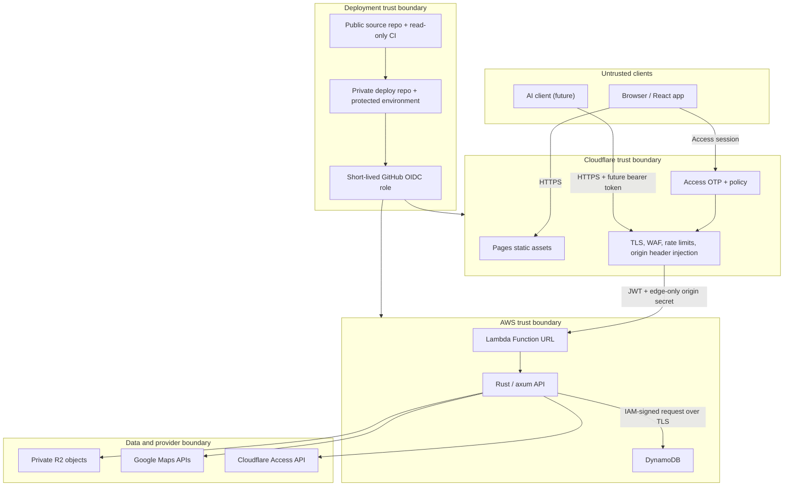

# Itinera Security Architecture

Status: living design · 2026-08-02 · applies to the public `itinera` repository

This document explains how Itinera protects identities, trip data, governance,
and deployment infrastructure. It is both a description of controls that exist
today and a checklist for controls that must exist before production launch.

The distinction matters. The current backend securely verifies Cloudflare
Access assertions and has a production DynamoDB user repository, but most
product APIs, trip-level persistence and authorization, origin shielding, and
AI tokens are still being built. A control described as **required** or
**planned** must not be presented as already active.

## 1. Reading this document

Each control has one of three states:

- **Implemented** — present in this repository and covered by automated tests.
- **Required before production** — part of the v1 security boundary, but not
  implemented or not verifiable from this public repository yet.
- **Planned with feature** — must be delivered with the later feature it
  protects, such as AI tokens or photo uploads.

Security is enforced by the backend and infrastructure. Frontend checks,
disabled buttons, hidden routes, and an undisclosed origin URL are usability or
discovery controls only; none of them grant authority.

## 2. Executive summary

Itinera is a private, collaborative application for small groups of friends. Its
main security model is:

1. Cloudflare Access authenticates a human by email one-time PIN.
2. Cloudflare forwards a signed application JWT to the Rust API.
3. The API independently verifies the signature, issuer, audience, lifetime,
   token type, and email before trusting the identity.
4. The API resolves that identity to an Itinera user.
5. Lambda accesses DynamoDB with its execution role; no database credential is
   stored in application configuration.
6. Every trip operation then performs a separate membership and role check.
7. Structural plan changes pass through leader approval or a poll; they cannot
   silently overwrite the shared plan.
8. Future AI credentials are short-lived, scoped, stored only as hashes, and
   cannot directly mutate shared state. Their drafts enter a human review queue.
9. In the target deployment, Cloudflare protects the public edge while an
   origin-only secret prevents a client from bypassing the edge and calling the
   Lambda application directly.
10. Target deployment uses short-lived GitHub OIDC credentials and
    least-privilege cloud roles; runtime secrets never live in this public
    repository.

Authentication answers **who is calling**. Membership, roles, scopes, and
governance answer **what that caller may do**. Both decisions are mandatory.

## 3. Current security posture

| Area                                  | Current state                                                                                                                                                           |
| ------------------------------------- | ----------------------------------------------------------------------------------------------------------------------------------------------------------------------- |
| Browser frontend                      | **Implemented as a mock-data UI.** It does not yet carry a production session or call the Rust API.                                                                     |
| Rust entrypoint                       | **Implemented.** The same axum router runs on Lambda or on a TCP listener bound to `127.0.0.1:3000`.                                                                    |
| Human authentication                  | **Implemented.** Production code verifies Cloudflare Access JWTs.                                                                                                       |
| Development authentication            | **Implemented and isolated.** It exists only when compiled with the default-off `dev-auth` Cargo feature and then explicitly enabled with `ITINERA_DEV_AUTH_ENABLED=1`. |
| API routes                            | **Partially implemented.** `/healthz` and authenticated `/me` exist. Most routes in `openapi.yaml` are a target contract.                                               |
| User storage                          | **Implemented, not deployed here.** Production uses conditional, strongly consistent DynamoDB operations; explicit development auth uses memory only.                   |
| Trip authorization                    | **Required before production.** No live trip routes or membership repository exist yet.                                                                                 |
| Cloudflare and AWS edge configuration | **Required before production.** The public repository deliberately contains no real deployment configuration or identifiers.                                            |
| Trip storage, R2, Maps, invitations   | **Planned with feature.** The DynamoDB physical model is designed, but only the user repository is implemented; other production adapters do not yet exist.             |
| AI API tokens                         | **Planned with feature.** The API contract and safety model exist; token authentication does not.                                                                       |

The current backend is an authentication slice, not a production-ready complete
application.

## 4. Security goals and boundaries

### 4.1 Goals

- **Confidentiality:** only trip members can read a trip's itinerary,
  discussions, preparation notes, booking references, and ledger.
- **Integrity:** a caller cannot impersonate another user, cross trip
  boundaries, bypass role checks, forge a vote, or apply a structural plan
  change outside the governance rules.
- **Availability and cost control:** malformed traffic, key-ID spam, provider
  outages, and request bursts should degrade predictably without multiplying
  external calls or cloud cost without bounds.
- **Accountability:** important mutations record who acted, whether a human or
  an AI token, what changed, and which approval or poll authorized it.
- **Data minimisation:** Itinera stores only information needed to plan the
  trip. It does not become a password store, payment processor, or document
  vault.
- **Recoverability:** persistent data and infrastructure changes must be
  auditable, backed up, and restorable.

### 4.2 Explicit non-goals for v1

- Anonymous or public trip sharing.
- Storing passwords or generating one-time login codes.
- Processing card payments or storing card numbers, bank credentials,
  passports, visas, or identity-document scans.
- Protecting a user whose email account or unlocked device is already
  compromised.
- Protecting data from an authorised cloud-account administrator. Least
  privilege and audit logs reduce this risk; they cannot eliminate it.
- Giving AI agents autonomous voting, administration, or direct write access.

### 4.3 Assets and classification

| Class               | Examples                                                                                                         | Handling                                                                                                       |
| ------------------- | ---------------------------------------------------------------------------------------------------------------- | -------------------------------------------------------------------------------------------------------------- |
| Public              | Source code, static frontend assets, generic API schema                                                          | May be cached and served publicly. Never place deployment identifiers or real data in examples.                |
| Internal            | Non-sensitive service metrics, schema versions, anonymous aggregate counts                                       | Accessible to operators; do not expose through public health endpoints.                                        |
| Sensitive user data | Email addresses, trip dates and locations, discussions, ledger entries, booking references, checklists, receipts | Authenticated and trip-scoped; encrypted in transit and at rest; excluded from public caches and routine logs. |
| Secrets             | Raw AI tokens, database credentials, Cloudflare API token, origin secret, provider keys, deployment credentials  | Managed secret storage only; never source control, URLs, analytics, client storage, or logs.                   |

Trip dates and locations deserve particular care: together they can reveal when
someone is travelling or away from home. Ledger and booking data can reveal
financial or reservation information even though Itinera does not process
payments.

## 5. Actors and authority

- **Unauthenticated visitor:** may reach only deliberately public static assets,
  the Cloudflare login flow, and a minimal health endpoint through the approved
  edge path.
- **Authenticated user:** has a verified application identity, but no implicit
  access to any trip.
- **Viewer:** may read a trip but cannot mutate it.
- **Member:** may collaborate within a trip: create ideas and discussions, edit
  permitted content, propose structural changes, and vote.
- **Leader:** has member abilities plus membership administration and the
  ability to decide structural proposals. A trip must always retain at least
  one leader.
- **AI token:** acts for one user with explicit `read` and/or `propose` scopes.
  It is never equivalent to the browser session and never gains `vote` or
  `admin` authority.
- **Deployment operator:** may release a reviewed commit through a protected
  GitHub environment and tightly scoped cloud roles.
- **External attacker:** has the source code and API contract, can discover
  public hostnames, and can send arbitrary requests. The design assumes no
  security through obscurity.

An authenticated member may also be malicious or simply make a mistake. Object
authorization, governance, audit history, and database constraints therefore
apply to trusted friends as well as unknown attackers.

## 6. Architecture and trust boundaries

The main boundaries are:

1. **Client to Cloudflare:** all client input is untrusted. TLS protects the
   connection, Access authenticates humans, and edge controls reject obvious
   abuse.
2. **Cloudflare to Lambda:** the JWT proves user identity; a separate secret
   header proves the request followed the approved edge path. Neither replaces
   the other.
3. **API to AWS data:** Lambda uses its execution role for narrowly scoped
   DynamoDB operations. There is no application database password. Repository
   decoders validate all stored records before they enter the domain.
4. **API to external providers:** the API uses narrowly scoped credentials and
   validates all data crossing provider boundaries.
5. **Source to deployment:** public CI cannot deploy and receives no production
   secrets. The private deployment repository selects a reviewed, pinned source
   commit and obtains short-lived cloud credentials.

## 7. Human authentication flow

### 7.1 End-to-end request

1. The browser requests the private application.
2. Cloudflare Access checks its application policy. If there is no valid Access
   session, Cloudflare hosts the email one-time-PIN flow. Itinera never sees,
   creates, stores, or verifies the code.
3. After Cloudflare authenticates the email, it forwards the API request with a
   signed `Cf-Access-Jwt-Assertion` application token.
4. **Required before production:** the edge removes any client-supplied copy of
   the origin-authentication header and injects its own secret value.
5. The Lambda API rejects the request unless the origin secret is valid, except
   for any narrowly documented infrastructure health path.
6. The API verifies the Access JWT independently. Passing through Cloudflare is
   not enough on its own.
7. The verified, canonical email resolves to one Itinera user. Production `/me`
   uses a strongly consistent DynamoDB lookup and a conditional first-login
   write; explicit development auth uses a process-local repository instead.
8. For a trip route, the API loads membership for that user and trip, then
   authorizes the requested action by role.
9. The data query is itself trip-scoped, so an authorization mistake in a
   handler does not turn an arbitrary object ID into cross-trip access.
10. Authenticated API responses are marked private and `no-store`; Cloudflare
    must never cache them as shared responses.

### 7.2 Access-policy requirement

Cloudflare Access is an app-wide login gate, while Itinera membership is
trip-specific. Production Access policy must be a closed allow-list or a group
managed by the invitation workflow. It must not use an `Everyone` rule or a
broad email-domain rule unless open registration is intentionally introduced.

Today `/me` provisions any identity that the Access policy admits. A user record
does **not** grant access to a trip. Before trip APIs launch, pending invitations
must bind the invited canonical email to the intended trip, and membership must
be created only for that same verified email.

Removing a user from one trip removes only that membership. App-wide Access
login is revoked only when the user belongs to no other trip. Revocation and
membership updates must be idempotent and recover safely if the Cloudflare API
is temporarily unavailable.

### 7.3 JWT validation that is implemented

The production `CloudflareAccessIdentityProvider` applies these controls:

- accepts only a non-empty assertion up to 16 KiB;
- requires a non-empty, whitespace-canonical key ID of at most 256 bytes;
- pins `RS256` in both the untrusted JWT header check and the verifier policy;
- never chooses an algorithm from token-controlled data;
- requires and verifies `exp`, `nbf`, `aud`, and `iss`;
- requires the application token type `app` and a valid email claim;
- accepts only the configured audience and the exact configured team issuer;
- canonicalises the verified email for stable user lookup;
- accepts the team origin only as an HTTPS root origin under
  `.cloudflareaccess.com`, with no credentials, port, query, or fragment;
- obtains JWKS only over HTTPS, refuses redirects, uses a two-second connection
  timeout and five-second total request timeout;
- accepts only RSA signing keys marked for `RS256` signatures, and rejects
  malformed or duplicate key sets;
- serialises key refreshes so concurrent requests do not cause a fetch storm;
- caches a key set for one hour, remembers a rejected key ID for 30 seconds,
  bounds that negative cache to 64 entries, and applies a process-wide
  five-second cooldown when attackers vary unknown key IDs;
- backs off for five seconds after a failed or malformed JWKS response; and
- during a brief JWKS outage, may use a previously known matching key for at
  most 24 hours. A successful refresh always replaces the set, so a key removed
  by Cloudflare is no longer accepted.

That last rule is an explicit availability trade-off. It prevents a temporary
Cloudflare outage from locking out every user, while limiting how long a cached
key can survive when freshness cannot be checked. A future incident involving a
suspected signing-key compromise should disable this stale-key fallback until
Cloudflare is reachable and the key set is confirmed.

Authentication errors are deliberately coarse: missing, invalid, and expired
credentials return `401`; a temporary identity-provider failure returns `503`.
Responses do not reveal signatures, claims, keys, or provider internals.

### 7.4 Development authentication

The development adapter treats an assertion as an email and is deliberately
insecure. Two independent opt-ins are required:

1. compile the backend with the default-off `dev-auth` Cargo feature; and
2. set `ITINERA_DEV_AUTH_ENABLED=1` at runtime.

A default production build contains no development adapter. If production
configuration is missing, startup fails; it never falls back to development
authentication. CI tests and lints both the default and all-feature builds.

The production build command must use the default feature set and a startup
smoke test must prove that setting `ITINERA_DEV_AUTH_ENABLED=1` is rejected.
Production deployment configuration must never enable the feature.

## 8. Origin and edge protection

### 8.1 Required v1 arrangement

- Cloudflare is the only supported public entry point for application traffic.
- TLS is mandatory from the client to Cloudflare and from Cloudflare to the AWS
  origin. HTTP redirects to HTTPS and HSTS is enabled after hostnames are final.
- The Function URL may need `AuthType: NONE` for direct Cloudflare proxying. AWS
  therefore considers it publicly invokable; the application must not confuse
  the Function URL setting with user authentication.
- Cloudflare strips a reserved header from incoming requests, inserts a
  high-entropy origin secret, and never exposes that value to browser code.
- The first API middleware compares that value without leaking timing or secret
  content, before parsing credentials or request bodies.
- The secret is held in managed runtime configuration, rotated periodically and
  immediately after suspected disclosure, and never written to Terraform state
  as a literal value.
- Missing or incorrect origin secrets are rejected and counted, but not logged
  verbatim.

JWT verification remains mandatory even after origin verification. The origin
secret proves the network path, not the end-user identity.

### 8.2 Residual risk

A shared header checked inside Lambda cannot stop an attacker from causing a
public Function URL invocation; it stops the request before application work,
but the invocation may still consume concurrency and a small amount of money.
Cloudflare rate limits also do not cover requests that bypass Cloudflare.

For friend-group scale this is an accepted v1 cost trade-off, paired with AWS
budgets, concurrency limits, alarms, and keeping the origin URL out of routine
publication. If direct-origin abuse becomes material, move to an origin that can
be restricted with IAM or a signed intermediary rather than treating secrecy of
the URL as protection.

### 8.3 Caching rules

- Cache fingerprinted static frontend assets.
- Do not edge-cache `/api/*`, `/me`, or any response containing user or trip
  data. Send `Cache-Control: private, no-store`.
- Never place credentials, tokens, invitation state, or sensitive query values
  in URLs, because URLs appear in browser history, proxy logs, and analytics.
- Health responses contain only generic liveness state, not provider names,
  versions, environment values, or dependency errors.

## 9. Authorization and tenant isolation

Authorization is a backend domain rule, not a route naming convention. Every
protected request resolves a principal containing:

- authentication kind: browser or AI token;
- stable Itinera user ID;
- token scopes when applicable; and
- membership and role for the target trip.

The intended policy is:

| Action                                         |         Viewer          |         Member          |                      Leader                      |                   AI token                   |
| ---------------------------------------------- | :---------------------: | :---------------------: | :----------------------------------------------: | :------------------------------------------: |
| Read a trip and its plan                       |           Yes           |           Yes           |                       Yes                        |    `read` scope, owner's memberships only    |
| Read ledger and discussions                    |           Yes           |           Yes           |                       Yes                        |    `read` scope, owner's memberships only    |
| Create ideas, comments, or proposals           |           No            |           Yes           |                       Yes                        | `propose` scope, but queued for owner review |
| Edit ordinary trip content                     |           No            |           Yes           |                       Yes                        |    `propose` scope, queued; never direct     |
| Add or correct ledger records                  |           No            |           Yes           |                       Yes                        |                   No in v1                   |
| Vote                                           |           No            |           Yes           |                       Yes                        |                    Never                     |
| Approve/reject/apply structural changes        |           No            |           No            |                       Yes                        |                    Never                     |
| Invite/remove members or change roles/settings |           No            |           No            |                       Yes                        |                    Never                     |
| Create a trip                                  | Any admitted human user | Any admitted human user | Any admitted human user becomes its first leader |                    Never                     |

Rules required in implementation:

- Resolve resources through `(trip_id, resource_id)` or an equivalent
  membership-scoped repository method. Never load by a caller-supplied object ID
  and authorize only afterward when a scoped lookup is possible.
- Return `404` when the caller cannot see whether an object exists. Use `403`
  when the object is visible but the caller lacks authority for a known action.
- Ignore any client-supplied `createdBy`, `paidBy` authority, owner, role,
  decision-maker, audit identity, or plan-version result that the server can
  derive itself.
- A member cannot promote themselves, remove the final leader, or mutate a
  membership in another trip.
- A vote is unique per `(poll_id, user_id)` and is changed transactionally, not
  appended as an unlimited series of votes.
- Structural proposals carry an immutable base plan version. Approval applies
  only if that version is still current, using a DynamoDB condition expression
  inside the write transaction; stale proposals must be rebased and reconsidered.
- Governance decisions and their resulting plan version are committed in one
  transaction. A retry must be idempotent and cannot apply a proposal twice.
- Content-history and audit records are written in the same transaction as the
  mutation they describe.

The physical data model reinforces these rules with tenant-scoped compound keys,
uniqueness claims, condition expressions, strongly consistent authorization
reads, and transactions. DynamoDB has no foreign keys, so repositories must
encode relationships explicitly and test every negative cross-trip path.
Handler checks alone are not sufficient. See [`DYNAMODB.md`](DYNAMODB.md).

## 10. AI token architecture (planned with feature)

AI routes deliberately use a credential separate from the human Access session:

1. A human creates a named token with `read` and/or `propose` scope and a TTL of
   1 hour, 8 hours, 24 hours, or at most 7 days.
2. The server generates at least 32 random bytes using a cryptographically secure
   generator. The plaintext `itn_...` token is shown once.
3. Only a lookup prefix and a SHA-256 digest are stored. A high-entropy token
   makes offline guessing infeasible; comparisons are constant-time.
4. The plaintext is never placed in a URL, cookie, log, analytics event, or
   browser `localStorage`.
5. Every request enforces expiry, revocation, scope, owner membership, and a
   per-token rate limit.
6. A token-originated mutation creates a `pending_review` item. The token owner
   must approve it from an authenticated browser session.
7. Approved structural drafts still require normal leader approval or a poll.
   Human review is not a governance bypass.
8. Token creation, use, review, and revocation are audit events. The UI displays
   creation time, expiry, scopes, last-used time, and provenance.

Cloudflare may bypass its human Access policy for the exact AI API path, but the
WAF, TLS, body limits, and abuse controls remain active. The bypass must not
cover browser pages or unrelated endpoints.

If a request presents both an Access assertion and an AI bearer token, the API
rejects it instead of silently selecting the more powerful identity. This
prevents credential-confusion bugs.

## 11. Browser and API protections

### 11.1 CSRF and CORS

Cloudflare Access uses a browser session cookie, so Access authentication alone
does not prove that a state-changing request was intentionally initiated by the
Itinera frontend.

The preferred deployment is same-origin frontend and API routing. If separate
origins are required:

- CORS allow-lists the one exact production frontend origin; never `*`, regexes
  matching arbitrary subdomains, or reflected origins.
- State changes use `POST`, `PUT`, `PATCH`, or `DELETE`; `GET`, `HEAD`, and
  `OPTIONS` are side-effect free.
- JSON endpoints require `Content-Type: application/json` and reject simple form
  content types.
- The HTTP client adds a fixed custom header to mutating browser requests, which
  forces a preflight for cross-origin calls.
- Middleware rejects `Sec-Fetch-Site: cross-site` for unsafe methods and verifies
  `Origin`, falling back to `Referer` only where necessary. Missing origin
  evidence fails closed after a monitored compatibility rollout.
- AI bearer clients are not cookie-authenticated and are not granted broad
  browser CORS access.

### 11.2 XSS and user-authored content

React renders user strings as text by default, and the current small emphasis
renderers build React elements rather than injecting HTML. Preserve that model:

- do not use `dangerouslySetInnerHTML` for trip content;
- if richer Markdown is introduced, disable raw HTML and use an audited
  sanitizer with a minimal allow-list;
- validate outbound links as absolute `https:` or, where justified, `http:`
  URLs; reject `javascript:`, `data:`, `file:`, and custom schemes;
- use `rel="noreferrer noopener"` for new-window links;
- do not execute, import, or interpolate user content as CSS, HTML, script, SVG,
  or a template;
- use a restrictive Content Security Policy. Google Maps origins must be listed
  explicitly rather than weakening the entire policy with broad wildcards;
- do not render arbitrary user-supplied URLs as images. Production images come
  from the private R2 path or a tightly allow-listed provider, preventing a trip
  entry from becoming a third-party tracking pixel;
- set `X-Content-Type-Options: nosniff`,
  `Referrer-Policy: strict-origin-when-cross-origin`, an explicit
  `frame-ancestors` policy, and a narrow `Permissions-Policy` at the edge.

The current frontend stores presentation preferences and weather-cache entries
in `localStorage`. Weather cache keys include coordinates and dates; before live
trip data is connected, that cache must move to ephemeral storage or be scoped,
expired, and cleared with the authenticated session. Authentication assertions,
AI tokens, booking data, ledger data, and trip content must never be persisted
there.

### 11.3 Input validation and errors

- Treat OpenAPI types as a contract, not validation by themselves. Validate on
  the server after deserialisation and before domain logic.
- Define maximum lengths for every user-authored string and collection before
  its endpoint ships. The current contract has several minimum lengths but
  still needs systematic maxima.
- Apply a global JSON-body limit (initial target: 1 MiB) and smaller route limits
  where practical. Uploads use separate limits and paths.
- Validate identifiers, enums, currency codes, time zones, dates, coordinates,
  monetary ranges, split totals, and collection counts.
- Reject unknown fields for security-sensitive commands so misspelled or
  attacker-added authority fields do not disappear silently.
- Return stable error codes and safe user messages. Log an internal correlation
  ID, not stack traces or provider responses, to clients.
- Use generic `401`, `403`, and `404` responses that do not reveal credentials,
  membership in unseen trips, or whether a token prefix exists.

## 12. Data, database, and object storage

### 12.1 DynamoDB

The implemented user adapter:

- loads the standard AWS region and Lambda execution-role credential chain;
- requires an explicit table name and rejects invalid names before startup;
- uses a SHA-256-derived canonical-email key to reduce raw-email exposure in
  operational key paths, while treating that digest as personal data rather
  than encryption;
- uses strongly consistent reads and a conditional write for concurrency-safe,
  unique first-login provisioning;
- validates item type, schema version, key, and email before returning a domain
  user;
- bounds SDK connection, read, attempt, and total-operation time; and
- maps provider and corrupt-record failures to generic API errors without
  exposing AWS details.

Before production deployment, infrastructure must use a Standard table with
encryption at rest, deletion protection, point-in-time recovery, alarms, and a
Lambda role limited to the exact table, index, and required data operations.
Static AWS keys must not be injected into Lambda. Deployment and recovery roles
remain separate from runtime. The physical keys, consistency decisions,
transactions, capacity bounds, and restore procedure are specified in
[`DYNAMODB.md`](DYNAMODB.md).

Future trip repositories must authorize through a strongly consistent direct
membership read, scope every object operation to its trip partition, avoid
runtime scans, and commit governance state, effects, idempotency claim, and audit
record together. Global secondary indexes are navigation aids and are never an
authorization source because they are eventually consistent.

The in-memory repository remains for explicitly compiled and enabled
development authentication only. It provides no durability, cross-instance
consistency, backup, or production authorization.

### 12.2 R2 and uploads

Production buckets are private. An unguessable object key is not authorization.
Objects are returned through an authorized application path or short-lived,
object-specific signed URL after checking trip membership.

When uploads are introduced:

- allow only the required raster formats, such as JPEG, PNG, and WebP;
- enforce byte-size, pixel-dimension, and file-count limits before issuing an
  upload or accepting metadata;
- inspect file signatures rather than trusting filename or `Content-Type`;
- generate object keys server-side and never use a user filename as a path;
- re-encode images and strip metadata, including location-bearing EXIF;
- reject SVG and other active content for photo/receipt surfaces;
- serve untrusted files with safe content types and disposition; and
- delete abandoned uploads and objects whose owning record is removed.

### 12.3 Data minimisation and retention

- Do not ask users to put payment-card data, banking credentials, passport
  scans, or authentication secrets into notes or receipt uploads.
- Booking references are sensitive and visible only to trip members.
- Store canonical email only where identity or invitations require it.
- Define account, trip, audit, object, log, and backup retention before launch.
- A future trip/account deletion flow must remove or anonymise dependent data
  and record only the minimum tombstone needed for integrity.
- Provider and editorial data must remain distinguishable from user-authored
  content for both trust and licensing reasons.

## 13. External providers and SSRF

- The JWT adapter demonstrates the required pattern: parse a configured URL as a
  typed URL, pin HTTPS and the expected host family, disable redirects, set
  small timeouts, validate the response schema, and bound retries and caches.
- The server never fetches an arbitrary user-authored `website`, `sourceUrl`,
  booking URL, or photo URL. These are display links unless a separate secure
  import service is designed.
- Any future server-side URL importer must prevent DNS rebinding, reject private,
  loopback, link-local, metadata-service, and non-HTTP destinations, revalidate
  every redirect, cap bytes and time, and isolate egress.
- Google browser keys are limited to map-rendering APIs and exact production
  referrers. Server keys are limited to the required APIs, quotas, and—only if a
  stable egress path actually exists—source addresses.
- The Cloudflare management token used for invitations receives only the policy
  permissions it needs. It cannot administer DNS, billing, or unrelated Access
  applications.
- All provider clients use deadlines, bounded retries with jitter, and response
  size limits. A provider failure cannot hold Lambda execution indefinitely.

## 14. Secrets, IAM, and deployment

### 14.1 Repository separation

The public repository contains source, tests, and the API contract, and is the
intended home for non-secret infrastructure modules when they are added. Its CI
token is `contents: read`; CI receives no production secrets and never performs
a production plan or deployment.

The private deployment repository contains real identifiers and operations
configuration. It checks out a reviewed source commit or tag rather than an
unreviewed moving branch.

Terraform state lives in an encrypted remote backend with tightly restricted
access and locking. Marking a Terraform output `sensitive` only hides display;
it does not remove plaintext from state. Runtime secrets should therefore be
created outside Terraform or referenced by managed-secret ARN rather than
passed as literal resource values.

### 14.2 Deployment identity

- GitHub Actions exchanges an OIDC assertion for short-lived AWS credentials;
  there are no long-lived AWS access keys in GitHub.
- The AWS trust policy pins repository, protected environment, audience, and
  intended branch/tag conditions.
- Production environments require approval and restrict which refs can deploy.
- The deployment role can update only the named application resources and pass
  only the application's execution role.
- The Lambda execution role has no deployment permissions and receives only the
  runtime actions it needs.
- Cloudflare and other provider tokens are separately scoped and rotated.
- Production artifacts use default Cargo features. `dev-auth` is forbidden.

### 14.3 Supply chain

- Rust and npm dependencies are lock-file pinned; the Rust toolchain is pinned.
- CI formats, lints, type-checks, builds, and tests frontend and backend. Backend
  CI runs both default and all-feature tests to prevent feature-only decay.
- Required next steps are automated dependency updates, Rust and npm advisory
  scanning, GitHub secret scanning/push protection, dependency review on pull
  requests, and CodeQL or equivalent static analysis.
- Third-party GitHub Actions should be pinned to reviewed commit SHAs in
  deployment workflows. Version tags are convenient but mutable.
- Branch protection requires passing checks and review before merge; production
  deploys consume only merged/reviewed commits.

## 15. Logging, audit, monitoring, and availability

### 15.1 Application logs

Structured logs include timestamp, request/correlation ID, route template,
method, status, duration, deployment version, and pseudonymous principal or
token ID where needed.

Never log:

- Access assertions, Access cookies, bearer tokens, origin secrets, OTPs;
- `Authorization` or authentication headers;
- AWS access keys, database credentials, or provider credentials;
- raw DynamoDB keys, expressions containing user data, or item bodies;
- full request/response bodies;
- booking references, receipt URLs, or ledger notes; or
- raw email addresses when a stable internal user ID is sufficient.

Authentication failures are logged by category, not credential content.
External error details remain in restricted logs and are mapped to generic API
responses.

### 15.2 Product audit trail

Audit records are separate from diagnostic logs. They record actor, actor type,
trip, action, target, timestamp, request ID, before/after reference or diff, and
the approval/poll/review that authorised the action. They must be append-only to
ordinary application roles and committed transactionally with the mutation.

At minimum, audit:

- invitations, membership and role changes;
- structural proposals, approvals, rejections, polls, votes, and applications;
- content edits and reversions;
- ledger changes and settlements;
- AI token creation/revocation and all AI-originated review decisions; and
- security-sensitive settings changes.

### 15.3 Alerts and abuse controls

Monitor and alert on:

- spikes in invalid JWTs, unknown key IDs, `401`, `403`, `429`, and origin-secret
  failures;
- JWKS refresh failures and stale-key use;
- repeated cross-trip authorization failures;
- AI token rate-limit violations or use after revocation;
- Lambda errors, throttling, duration, concurrency, and unexpected spend;
- DynamoDB throttling, consumed capacity, transaction conflicts, system errors,
  point-in-time recovery status, and restore failures;
- Cloudflare policy changes and unusual deployment activity; and
- dependency or secret-scanning findings.

In production, Cloudflare applies coarse IP/application limits. The API adds
per-user, per-token, and sensitive-action limits. Lambda reserved concurrency,
bounded DynamoDB capacity and requests, provider quotas, and AWS budgets contain
resource and cost impact.

The implemented JWKS cache prevents one malformed request per key ID from
turning into an outbound request storm. The refresh mutex also prevents
concurrent cache misses from fanning out.

## 16. Threat model

| Threat                                | Primary controls                                                                                              | Residual risk / status                                                                                                            |
| ------------------------------------- | ------------------------------------------------------------------------------------------------------------- | --------------------------------------------------------------------------------------------------------------------------------- |
| Forged Cloudflare identity            | RS256 pinning; signature, issuer, audience, lifetime and token-type validation; strict JWKS origin            | **Implemented.** Compromised Cloudflare account or signing infrastructure remains a provider risk.                                |
| Compromised email mailbox             | OTP handled by Cloudflare; short Access session; rapid policy removal                                         | Email OTP proves mailbox access, not strong phishing resistance. Stronger identity/MFA can replace the provider through the port. |
| Direct Lambda-origin bypass           | Independent JWT verification; edge-only origin secret; WAF; budgets/concurrency                               | JWT validation is implemented. Origin middleware and deployment are **required**; public invocation cost remains a v1 trade-off.  |
| Cross-trip object access (IDOR)       | Trip-partition keys; direct consistent membership read; backend role checks; negative authorization tests     | **Required before trip APIs.** One of the highest-priority launch risks.                                                          |
| Role or governance bypass             | Server-derived actor/role; transactional proposal application; plan-version compare-and-swap; audit           | **Required with trip domain.** Frontend confirmations are not enforcement.                                                        |
| CSRF through an authenticated browser | Same-origin routing; strict CORS; JSON/custom header; Fetch Metadata and Origin checks; no state-changing GET | **Required before live frontend/API cutover.**                                                                                    |
| Stored or reflected XSS               | React text rendering; no raw HTML; URL scheme validation; sanitised Markdown; CSP and security headers        | Current renderers avoid HTML injection. URL validation and deployment headers are still required.                                 |
| DynamoDB expression or key injection  | Fixed expressions and key prefixes; SDK placeholders; validated IDs; no caller-selected table/index           | **Implemented for users; required for every later repository.**                                                                   |
| SSRF through links or imports         | User URLs are display-only; allow-listed provider clients; strict URL parsing, egress and redirect policy     | JWKS client is hardened. Other provider/import clients are planned.                                                               |
| Malicious upload                      | Private bucket; type/size/signature checks; re-encoding; EXIF stripping; generated object keys; no SVG        | **Planned with uploads.**                                                                                                         |
| AI token theft or overreach           | High entropy; digest-only storage; short TTL; scopes; rate limit; no vote/admin; human review airlock         | **Planned with AI tokens.** A stolen token can act within its remaining read/propose scope until expiry/revocation.               |
| JWKS key-ID denial of service         | Bounded negative cache, global cooldown, failure backoff, single-flight refresh, timeouts                     | **Implemented per Lambda process.** Edge and AWS limits cover distributed instances.                                              |
| Provider outage                       | Timeouts; bounded retries; recent matching-key fallback; generic `503`; circuit breakers                      | Availability can still degrade. Stale signing-key acceptance is limited to 24 hours during JWKS failure.                          |
| Dependency/build compromise           | Lock files, pinned toolchain, read-only CI, reviewed private deploy path, OIDC                                | Advisory scanning, SHA-pinned deployment actions, and protected deployment configuration are required.                            |
| Secret leakage                        | No repository secrets; managed secret storage; log redaction; short-lived deployment identity; rotation       | Private deploy and runtime configuration are not visible here and must be audited before launch.                                  |
| Data loss or corruption               | Transactions, version history, PITR, deletion protection, restore tests, idempotent mutations                 | User persistence is implemented; production protection and restore drill are still **required**.                                  |
| Malicious authorised leader           | Audit trail, at least one leader, reversible history, visible governance outcomes                             | A leader intentionally has substantial authority. v1 does not require multi-leader approval for administration.                   |

## 17. Security verification

### 17.1 Automated tests already present

The authentication suite covers, among other cases:

- missing, malformed, expired, not-yet-valid, wrong-issuer, wrong-audience,
  wrong-type, wrong-algorithm, wrong-key, missing-email, and malformed-key
  assertions;
- valid authentication and canonical user provisioning;
- key rotation, cache freshness, negative caching, bounded unknown-key refresh,
  and short JWKS outages;
- unsafe Cloudflare team origins;
- production startup failing without required configuration;
- development auth being unavailable from default production builds;
- stable, non-plaintext email keys and strict DynamoDB record decoding; and
- strongly consistent lookups plus conditional, duplicate-safe provisioning
  requests through the AWS SDK mock interceptor.

### 17.2 Tests required as the application grows

- A route inventory test proving every route except the explicit public allow-list
  requires a principal.
- A concurrent cold-cache test proving many simultaneous key misses produce one
  JWKS request, plus a redirecting JWKS endpoint test.
- A role/action matrix test for viewer, member, leader, and both AI scopes.
- Cross-trip tests that try every object route using an ID from another trip.
- Leader-count, unique-vote, stale-plan, idempotency, and transaction-race tests.
- CSRF, Origin, Fetch Metadata, CORS preflight, content-type, and body-limit tests.
- XSS payload and unsafe-URL tests for every user-authored rendering surface.
- Upload type confusion, oversized image, decompression-bomb, EXIF, and object
  authorization tests.
- Token expiry, revocation, digest comparison, ambiguous-credential, scope,
  owner-review, and rate-limit tests.
- DynamoDB integration tests against an isolated production-shaped table,
  including concurrent conditions, transaction cancellation, pagination,
  malformed records, schema evolution, and capacity assumptions.
- Deployment tests for private origin routing, security headers, no shared API
  caching, secret absence, IAM permissions, and default Cargo features.
- Backup restore exercises and an incident-response tabletop before storing
  irreplaceable real data.

Security tests must assert denied behaviour as strongly as successful flows.

## 18. Production readiness gates

The application must not be treated as production-ready until all of these are
verified in the deployed environment:

1. Cloudflare Access policy is closed to approved identities; both Pages and API
   routes are protected as intended.
2. Lambda validates an edge-only origin secret, and Cloudflare strips a
   client-supplied copy before injecting it.
3. Production artifact lacks `dev-auth`; missing auth configuration fails
   startup.
4. DynamoDB is deployed with exact-resource runtime IAM, encryption, deletion
   protection, point-in-time recovery, alarms, bounded capacity, transactional
   invariants, and a tested restore-and-cutover procedure.
5. Every trip route enforces membership and role in both service and scoped data
   access; the complete cross-trip test suite passes.
6. Same-origin or exact-origin CORS, CSRF protections, JSON/body limits, and
   security headers are deployed and tested.
7. Authenticated responses cannot enter shared Cloudflare or browser caches.
8. Runtime secrets use managed storage; GitHub deploys with protected OIDC roles;
   Terraform state and logs contain no secret literals.
9. WAF/rate limits, Lambda concurrency, provider quotas, budgets, structured
   redacted logs, audit records, and actionable alarms are active.
10. The live frontend uses the HTTP client without storing credentials or
    sensitive trip data in `localStorage`.
11. Dependency, secret, and static-analysis checks are enabled and blocking at
    an agreed severity.
12. Retention, deletion, backup, restore, and incident procedures have an owner
    and have been exercised.

Feature-specific gates apply before enabling AI tokens, uploads, automated
Access-policy invitations, or external URL imports.

## 19. Incident response

For any suspected security incident:

1. **Contain:** disable the affected route or deployment, revoke the user/token,
   remove Access policy entries, reduce concurrency, or put the application in
   read-only mode.
2. **Preserve:** retain relevant Cloudflare, AWS, application, database, audit,
   and deployment logs without copying credentials or sensitive bodies into an
   issue.
3. **Rotate:** replace every potentially exposed origin, provider, AWS, or
   deployment credential. Revocation precedes code cleanup.
4. **Assess:** identify affected identities, trips, objects, actions, and time
   window using request IDs and audit history.
5. **Recover:** patch from a reviewed commit, restore or reconcile data, verify
   controls, then re-enable traffic gradually.
6. **Communicate:** tell affected friends plainly what data or actions may have
   been exposed and what they should do.
7. **Learn:** add a regression test, update this document and the runbook, and
   record why existing controls did not prevent or detect the event sooner.

Specific first actions:

- **Leaked AI token:** revoke its digest record, inspect `last_used_at` and audit
  entries, reject pending drafts, then notify the owner.
- **Compromised email/user:** remove the Access grant, revoke Access sessions,
  remove or suspend memberships, and inspect recent mutations.
- **Leaked origin secret:** rotate both the Cloudflare-injected value and Lambda
  expectation, then review direct-origin failure metrics.
- **Leaked cloud/provider credential:** revoke it at the provider before
  redeployment; inspect provider audit logs for use outside expected roles.
- **Suspected signing-key compromise:** stop stale-key fallback, refresh JWKS,
  and follow Cloudflare incident guidance before restoring authentication.

Operational hostnames, account identifiers, contacts, exact secret locations,
and recovery commands belong in the private deployment runbook, not this public
document.

## 20. Security decision record

Accepted v1 decisions and their trade-offs:

- **Cloudflare email OTP instead of application passwords:** removes password and
  OTP infrastructure from Itinera, but security depends on the user's mailbox
  and Cloudflare account.
- **Independent JWT validation at the origin:** protects against spoofed headers
  and proxy misconfiguration even though Cloudflare already made an edge
  decision.
- **Function URL plus edge-only shared secret:** preserves the low-cost
  architecture, but cannot prevent all direct invocation cost. It is not a
  substitute for JWT verification.
- **DynamoDB instead of an external SQL service:** keeps persistence in the AWS
  account and removes database credentials, connections, and a third provider;
  in return, keys, conditions, bounded transactions, and tests must explicitly
  replace relational constraints.
- **Up to 24-hour known-key fallback during JWKS outage:** favours short-term
  availability with a bounded stale-key risk.
- **No AI direct writes:** adds human friction intentionally; a compromised or
  hallucinating agent cannot silently change shared state.
- **Public application source, private deployment facts:** supports review and
  reuse without pretending an undisclosed URL is an authorization boundary.
- **No public share links in v1:** avoids introducing a second, bearer-link-based
  read authorization system before the private model is mature.

Changes to these decisions require a security review and an update to this
document in the same pull request.

## 21. References

- [Cloudflare: Validate Access JWTs](https://developers.cloudflare.com/cloudflare-one/access-controls/applications/http-apps/authorization-cookie/validating-json/)
- [AWS: Control access to Lambda function URLs](https://docs.aws.amazon.com/lambda/latest/dg/urls-auth.html)
- [AWS: DynamoDB preventative security best practices](https://docs.aws.amazon.com/amazondynamodb/latest/developerguide/best-practices-security-preventative.html)
- [AWS: DynamoDB backup and restore](https://docs.aws.amazon.com/amazondynamodb/latest/developerguide/Backup-and-Restore.html)
- [GitHub: Configuring OIDC in AWS](https://docs.github.com/en/actions/how-tos/secure-your-work/security-harden-deployments/oidc-in-aws)
- [RFC 8725: JSON Web Token Best Current Practices](https://www.rfc-editor.org/rfc/rfc8725)
- [OWASP: REST Security Cheat Sheet](https://cheatsheetseries.owasp.org/cheatsheets/REST_Security_Cheat_Sheet.html)
- [OWASP: CSRF Prevention Cheat Sheet](https://cheatsheetseries.owasp.org/cheatsheets/Cross-Site_Request_Forgery_Prevention_Cheat_Sheet.html)
- [OWASP: XSS Prevention Cheat Sheet](https://cheatsheetseries.owasp.org/cheatsheets/Cross_Site_Scripting_Prevention_Cheat_Sheet.html)
- [OWASP: File Upload Cheat Sheet](https://cheatsheetseries.owasp.org/cheatsheets/File_Upload_Cheat_Sheet.html)
