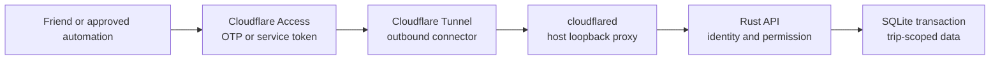

# Keeping Itinera private

_Last reviewed 7 August 2026 · security direction for the public Itinera repository_

## TL;DR

- Cloudflare Access authenticates people with email one-time codes and a closed
  allowlist; Itinera stores no passwords.
- Rust independently verifies every Access assertion, including signature,
  issuer, audience, lifetime, token type, and unambiguous human/service shape.
- Approved automation uses named Cloudflare service tokens mapped to an owner
  and narrow trip scopes; it cannot vote, administer, approve, or use direct
  mutation routes.
- Cloudflare Tunnel is the only API ingress. `cloudflared` initiates the
  connection and proxies to a loopback-only container port.
- The EC2 host has no public IPv4, SSH, inbound security-group rule, or public
  application listener. IPv6 internet access is outbound-only through an
  egress-only internet gateway.
- Every trip read checks direct membership in the same database snapshot. Every
  mutation begins `BEGIN IMMEDIATE` and rechecks the required role before any
  state, audit, or idempotency write.
- SQLite uses WAL, `synchronous = FULL`, foreign keys, a bounded pool, and one
  application process on an encrypted retained EBS volume.
- Daily SQLite Online Backup snapshots are integrity-checked and uploaded to a
  private versioned S3 bucket. Raw copies of a live WAL database are forbidden.
- The container is non-root, read-only, capability-free, and denied the host
  instance role. SSM replaces SSH; host and container patching are explicit
  operational duties.
- Production traffic uses HTTPS and private, non-shared API responses; secrets
  and private data stay out of URLs, client storage, analytics, and routine logs.
- Body limits, timeouts, service quotas, idempotency limits, standard T CPU
  credits, disk thresholds, budgets, and alerts bound work and spending.
- Public source and Terraform remain separate from private deployment values,
  state, host credentials, Tunnel tokens, and application secrets.
- Development authentication requires both a default-off build feature and an
  explicit runtime switch, so production cannot enable it accidentally. It
  never selects volatile persistence.

Itinera is a small application for people we know, but the information inside
it is not small. A trip can reveal where friends will be, when their homes may
be empty, what they have booked, what they have spent, and what they have said
to one another.

Security here has three practical jobs: keep private trip data among the
travellers, prevent anyone from silently changing the group's plan, and stop a
public cloud endpoint from becoming an open tab on the owner's wallet. The
design gives each layer one understandable responsibility: Cloudflare Access
decides who may approach the app, Tunnel provides an outbound-only route to the
host, Rust decides what an admitted identity may do, and SQLite commits each
authorized operation inside the right trip transaction.

> **An honest status note.** The target in
> [`adr/0001-single-node-sqlite.md`](adr/0001-single-node-sqlite.md) is accepted,
> and the undeployed Lambda/DynamoDB application has been archived and removed
> before SQLite capabilities are ported. There is temporarily no
> persistence-backed runtime binary. The old Worker, CloudFront, and Terraform
> code is frozen, cannot produce a deployable application from this tree, and
> must not be used to create the private environment. No private environment or
> live production data exists.
>
> The implemented API includes users; trips/members/invites;
> candidates/plans; content history and safe revert; proposals and polls;
> discussions; ledger/settlements; notices/checklists; and scoped service
> identities. Direct membership is authoritative, mutation roles are rechecked
> transactionally, and every current service mutation remains fail-closed. The
> owner review queue, uploads, external Cloudflare invite adapter, Google place
> adapter, SQLite runtime, container, host operations, and replacement
> infrastructure are not implemented yet. The frontend still uses mock data;
> its direct Open-Meteo prototype is disabled for real mode until separately
> reviewed. Provider placeholders fail closed rather than simulating side
> effects.
> SQLite persistence is currently authoritative for users, trips, memberships,
> invites, candidates, Plan v1, direct content mutations, shared content
> history, and safe revert. Each supported content mutation changes its entity
> and appends typed audit rows in one writer transaction. Service-authored,
> notice, proposal-owned `in_plan`, and ledger-linked booking history remain
> fail-closed until their owning SQLite capability can validate the missing
> mapping or reciprocal target.
>
> This article is authoritative for security direction; the code remains
> authoritative for what is implemented.

## What could go wrong?

The threat model starts with consequences, not products.

**A stranger reads our private lives.** Dates and locations can disclose when
someone is away. Booking references, expense records, checklists, photos, and
conversations may be just as sensitive. A guessed URL, a public repository, or
membership of somebody else's trip must not reveal any of them.

**Someone changes the shared truth.** A signed-in user must not be able to
impersonate another traveller, cross into another trip, forge a vote, or bypass
the group rules by calling an API directly. Hidden buttons are useful interface
design, not security.

**Automated traffic consumes the owner's host and provider quotas.** Internet
noise should stop at Cloudflare Access, while admitted traffic still faces
connection, body, timeout, operation, and service-identity limits. Standard T
CPU credits cap burst cost by throttling; disk and backup thresholds protect the
single database. Budgets and alarms warn the owner, but they are not a hard
spending cap.

**A credential or dependency becomes the shortcut.** The repository is public,
so the design assumes every hostname and line of code is known. It relies on
short-lived identity assertions, narrowly scoped cloud roles, private
deployment values, and reviewed dependencies—not obscurity. Email-account,
Cloudflare-account, AWS-account, and deployment-account compromise remain
serious risks, which is why their human administrators need strong unique
passwords and 2FA.

**Untrusted content escapes its box.** A trip title, comment, link, photo,
provider response, or API body may be malformed or malicious. It must remain
data—not become executable HTML, a tracking image, an internal-network request,
or an oversized job that consumes resources.

Itinera deliberately does not store passwords, card or bank credentials,
passport scans, or identity documents. There are no anonymous public trip
links in the first version. The app also cannot protect a session on an
unlocked or compromised device, or stop an authorised traveller from copying
information they can legitimately see.

## The journey of a trusted request

The production route is short, but its three credentials answer different
questions.

First, a friend signs in through Cloudflare Access with an email one-time code.
Itinera never receives or stores a password. Approved automation uses a
specifically admitted Cloudflare Access service token. In either case,
Access admits the caller and gives the origin a signed application JWT. A human
assertion identifies an email; a service assertion identifies a service-token
client. Those are intentionally different kinds of principal. The Access
policy is a closed guest list of approved email addresses and specifically
named services—not `Everyone`, a broad email domain, or any service token.

The static Pages site and API use separate Access applications. Pages admits
only one reusable human-admission group; the API references that same group and
separately admits explicitly named application services and the health probe.
Invite/revoke reconciliation mutates the group once rather than attempting two
non-atomic policy edits. Direct or preview Pages hostnames are protected or
disabled, so they cannot bypass the human gate. The static bundle is still
treated as public code and contains no secret; Access protects who can use the
application, not the confidentiality of downloaded JavaScript. Rust pins only
the API application's audience; a Pages assertion is never accepted as an API
identity. A global Access session may avoid a second credential prompt, but it
does not replace the API application's domain cookie: the browser must complete
the explicit API-session bootstrap below before cross-origin API calls.

`cloudflared` maintains connections from the host to Cloudflare over IPv6. Its
token proves that this connector may join one named Tunnel; it does not identify
the caller and never grants trip access. The token is read from a root-owned
credential file, not a command argument, image, Terraform value, or container
environment. Cloudflare routes the protected API hostname only to
`http://127.0.0.1:3000` on that connector. That origin router verifies an API
Access assertion before every route. Its no-data `/healthz` verifies the exact
API audience but does not resolve a domain principal; a dedicated probe token
is matched by an exact configured `common_name` digest and can do nothing else
in Rust. The human-only `/session/bootstrap` route likewise verifies the exact
API audience and human claim shape, returns no private data, performs no
provisioning, and redirects only to the one configured Pages root; it accepts
no caller-controlled destination and rejects services and the probe. All
domain routes continue through full human/service mapping, quota, scope, and
membership authorization.

Local database readiness is a different listener at `127.0.0.1:3001`, omitted
from Tunnel configuration and exposing no application route. It validates the
exact schema/SQLite source and a database read. The current combined,
unauthenticated health route is transitional; runtime cutover must split it so a
Tunnel route never doubles as an authorization bypass.

There is no alternate host route. The instance has no public IPv4, inbound
security-group rule, SSH listener, or VPC-visible app port. Its globally
routable IPv6 is behind an egress-only internet gateway, so the internet cannot
initiate a connection. Docker publishes only on host loopback. The app uses an
IPv6 bridge backed by an ENI-delegated prefix, not host networking; this gives
it IPv6 provider access while preserving the IMDS hop boundary.

Rust verifies the Access assertion rather than treating the tunnel or a proxy
header as identity. It checks signature, issuer, audience, lifetime, and token
type, resolves the principal, and then loads direct trip membership. Incoming
Cloudflare client-ID/client-secret headers, Access cookies/tokens, and other
credential variants are removed before application logs and handlers; only the
cryptographically verified assertion may establish identity. Forwarded client
addresses are diagnostic input, never authorization.

The Tunnel token says “this host may connect to this Tunnel.” The Access JWT
says “Cloudflare authenticated this human or named service.” The direct
membership row and service scope say “this principal may perform this trip
operation.” All three boundaries fail closed. API responses remain
`Cache-Control: private, no-store`, so Cloudflare or a browser cannot share one
member's private response with another.

## Being signed in is not being invited

An email address is a login alias, not the permanent identity of a person.
Itinera creates a stable `userId` and stores the canonical email as a separate
claim. A future verified email-change flow can replace that claim without
rewriting memberships, votes, expenses, or history. The repository creates the
profile and unique claim atomically. SQLite resolves both in one database
snapshot; the archived adapter used strongly consistent reads.

Trip APIs enforce the next boundary: every read and write loads current
membership from authoritative storage and checks the required role. Repository
methods accept a `tripId` and operate on trip-scoped keys; a navigation index
helps list trips, but its results are rechecked and are never evidence of
permission. SQLite uses a membership index for navigation. Mutations repeat the membership/role
condition inside their transaction. Actor IDs, audit identities, and ballot
ownership come from the verified principal, never from request JSON.

Trip application services and repository ports carry a typed authorization
context. A human context contains its stable user ID; a service context retains
both the owner ID and the service mapping ID. The service ID is never discarded
in favor of impersonating its owner. Implemented SQLite trip operations recheck
human membership in the same transaction as protected rows. They reject service
contexts before protected data access because the SQLite service-mapping
capability has not yet landed; when it does, reads will recheck the active
mapping, `read` scope, trip allowlist, and current owner membership in that
transaction. Trip creation and invitation acceptance acquire their writer
transaction before requiring a human context whose ID matches the validated
creator or invitee; a service or mismatched human cannot write any row.
Member/profile reads are joined in the same SQLite snapshot and cannot open a
second user-repository connection after authorization.

Content history follows the same distinction between reading and writing.
Viewers may inspect applied and reverted audit events because they are private
trip data they are already permitted to read; pending and rejected review
material remains owner-scoped and is not returned. Leaders and members may
revert because they already may edit those content fields. No role may turn the
route into a generic write:
the request names only a server-issued edit id, the repository resolves it only
with the route trip's composite key, and a closed allowlist maps the stored
entity/field pair to typed Rust code. A foreign edit id returns the same
not-found result as a missing one. Notice edits and reverts keep their
author-or-leader policy rather than falling through to generic editor access.
The repository loads the current notice's stored author, lets a current editor
author manage it, and otherwise requires a current leader; that exact role is
repeated in the same transaction as the notice and audit changes.

A revert transaction rechecks the editor role and conditions the target on its
strongly read revision and exact current payload. The live field must still
equal the stored event's new value. It marks the original event reverted with
the authenticated actor and commit time and appends a create-only compensating
event; it never deletes or rewrites the historical old/new values. Concurrent
successful retries are idempotent, while unrelated concurrent edits fail with
a conflict. Malformed or unsupported stored events fail closed. The bodyless
route has an explicit 1 KiB streaming limit before its empty-body check, and
history processing stops at 1,000 audit rows until cursor pagination and a
direct edit-ID lookup replace that first-slice ceiling. Encoded audit reads and
the serialized response also stop at 4 MiB, and a new revert is rejected when
its projected compensation would cross either boundary. Under SQLite, every
trip, candidate, day, stop, notice, and revert writer counts and validates the
same bounded graph after `BEGIN IMMEDIATE`; the single writer reservation keeps
concurrent appenders from both consuming the final capacity. An already-reverted
command remains a no-op at the ceiling. SQLite reads membership and the bounded
history graph in one transaction. Persistent inconsistency still fails closed.
Provenance must also
be chronological and acyclic, so an impossible
closed compensation graph cannot be mistaken for completed work. Revert values
use the normal write validators, and candidate `in_plan`
state remains controlled only by structural governance.

Removing a membership takes effect in that transaction even if an external
identity provider is unavailable. App-wide login is deliberately not revoked
inline: a person may belong to another trip, and an external policy change
cannot be atomic with the membership database. The integration adapter must reconcile desired
login state idempotently from all current memberships and pending invites. It
updates the one reusable human-admission group referenced by both Pages and API;
it never adds application services or the health probe. Until reconciliation, a
removed user may still authenticate but cannot read any trip without a current
membership record.

The same rule protects the shared plan from honest mistakes. Suggestions may
be drafted freely, but structural changes follow the trip's leader-approval or
poll flow. Applying an approved change uses a transaction, an expected version,
and proposal status so retries cannot silently apply it twice or overwrite a
newer plan. Every direct member may read proposals; leaders and members may
submit; viewers cannot write; and only leaders may approve or reject directly.
Both proposal routes are now implemented. A poll-routed submission creates the
proposal and its plan-change poll together, and `/to-poll` revision-guards the
existing proposal while creating its poll. Poll and option ids and proposal
links are server-owned, so callers cannot attach an unrelated proposal or leave
one side of the transition stranded.

Publication treats every opaque child or proposal ID as a trip-scoped reference,
not authority. After acquiring the SQLite writer reservation, one transaction
rechecks the direct leader record, exact current plan ID/version, stored proposal
revision, every source Plan/Day/Stop revision, and every affected candidate
revision. The next immutable plan rows and drafted places are create-only.
Candidate `in_plan` state is recomputed from
the resulting structure; a rejected candidate cannot be adopted. Candidate
records and the trip-owned Place snapshots used by a status transition are
strictly revalidated before a new revision is written. A missing current-plan
place, malformed server-owned record, or exhausted revision counter is corrupt
storage and fails closed.
ChangeSets are capped at 20 operations and by the existing request/JSON size
limits. Publication continues to stop before 100 actions or 3 MiB during the
SQLite migration; although those began as DynamoDB transaction headroom, they
remain a bounded-memory/product contract until separately reviewed. Repeated
approval/rejection returns the original completed decision;
stale or losing concurrent decisions return conflict without partial effects.

Poll reads allow every current direct member, including viewers. Creation and
voting require a current leader/member; opening requires the author to remain an
editor or the actor to be a leader; closing requires a leader. Those roles are
loaded from direct membership rows and repeated inside each mutation
transaction. A foreign poll id is resolved only with the route trip's composite
key and therefore behaves like a missing id.

Decision-poll creation reads the full direct membership set after `BEGIN
IMMEDIATE` and freezes quorum as half, rounded up, of leaders and members only.
Viewers remain read-only and do not inflate the electorate. The writer
reservation keeps membership changes from producing a mixed quorum snapshot.
Each voter has one
ballot row keyed by the authenticated user. Casting, changing, or withdrawing a
ballot also advances the poll revision in the same transaction. Close conditions
that revision, preventing a leader from deciding on a vote snapshot while a
concurrent ballot commits. It requires quorum, one unique top option, and more
than half of distinct participating voters; ties and plurality-only results fail
without selecting by storage order. Identical ballots and already-terminal close
requests are idempotent. Strict codecs reject malformed options, timestamps,
results, ownership, and proposal links. The stored terminal result must agree
with the actual decisive winner and the linked proposal status; inconsistent
records fail closed. The deadline is a hard UTC boundary: an unopened poll may
not open after it, and a new or changed ballot may not commit after it. A ballot
timestamp before poll creation is also rejected before persistence, so a server
clock rollback cannot write a row that its reader would reject. A
passing plan-change poll enters the same stale-safe proposal publication
boundary; keep and stale outcomes update poll and proposal together without
changing plan rows. If a concurrent re-poll attempt loses its transaction, it
is treated as an idempotent success only when the proposal now points to a new
poll; the unchanged terminal poll is a conflict.
An older no-decision poll remains readable after its replacement resolves only
when the proposal names a valid replacement poll whose result matches the
proposal's current status.

Poll endpoints have explicit request-body ceilings. Bodyless operations accept
at most 1 KiB before rejecting any non-empty body, vote payloads accept at most
8 KiB, and poll creation accepts at most 32 KiB. Oversized request bodies return
`413` before application logic runs.

Discussion reads likewise allow every current direct member, including
viewers. Creating a thread, adding a comment, or reacting requires a current
leader/member. Reads authorize membership and data in one SQLite snapshot, and
each write repeats the role after acquiring the writer reservation. A navigation
index result or opaque child ID is never authorization. Candidate and poll
anchors resolve only inside the route trip; day and stop anchors must be in the
exact current plan, whose pointer and child revisions are checked at thread
creation. A foreign thread or comment ID is indistinguishable from a missing ID
under the route trip.

A unique `(trip_id, anchor_key)` owns each strict thread anchor. Thread creation
inserts that thread and its first server-ID comment in one transaction,
preventing duplicates, orphans, or empty threads. Comment creation advances the
thread revision/activity and inserts its server-issued ID. Comment counts are
derived. Reactions accept only an emoji and desired `active` boolean;
the authenticated actor supplies ownership. Repeating the desired state is
idempotent, while an unrelated concurrent comment revision returns conflict.
Foreign keys, unique constraints, and strict bounded reads reject orphan
comments, malformed ownership, invalid UTC times, duplicated reactions, and
corrupt trip/thread links. Current-plan
anchors additionally validate every stored Plan/Day/Stop field, not only its
key and revision, so corrupt plan data cannot become authority.

Thread and comment collections stop at 1,000 rows and responses at 4 MiB.
Bodyless discussion reads accept at most 1 KiB before their empty-body check,
thread/comment writes accept at most 64 KiB, and reaction bodies at most 1 KiB.
Bodies and titles are bounded character strings. Markdown is returned as data;
the frontend's small emphasis renderer creates React text nodes and never
injects raw HTML.

Automation is deliberately less powerful than a person. Only Cloudflare's
canonical service-token client ID shape (32 lowercase hexadecimal characters
plus `.access`) can map to one owner, explicit trip IDs, and explicit
`read`/`propose` scopes in durable storage. Rejecting every other shape prevents a
pasted client secret from becoming a stored verifier or displayed hint. The raw
ID is reduced to a short display hint and a SHA-256 lookup digest; the client
secret is never accepted. Services are never auto-provisioned as people, and
`common_name` is never parsed as an email. Ambiguous claims containing both
identity shapes, and service claims without an explicitly empty `sub`, are
rejected.

Registration is human-only. `read` requires the owner to be a current direct
member of every selected trip; `propose` requires a current leader/member. The
SQLite target starts `BEGIN IMMEDIATE`, rechecks those memberships, and creates
one retained owner mapping whose client-ID digest is globally unique, together
with its scopes and trips. A service mapping is still navigation, not trip
authority: each data repository rechecks the owner's current direct membership.
Existing mutation handlers explicitly require a human principal, so services
cannot vote, administer, approve, invite, or directly edit even when they carry
`propose`. The next review-queue slice will give `propose` only narrow draft
commands whose output remains owner-scoped.

Mapping lifetime is limited to 1, 8, 24, or 168 hours. Authentication
resolves the exact active mapping by digest in the same SQLite writer
transaction that increments a 300-request UTC-hour bucket. Application checks
enforce the mapping expiry and exact close-plus-48-hour usage-row expiry;
physical cleanup is not authority. Each auth transaction removes at most 128
valid expired rows for that mapping, and a bounded, cursor-resumable
startup/maintenance job catches up global backlog in 500-row transactions.
Normally no more than the current plus 48 prior hourly buckets remain per
mapping; malformed or future-dated rows fail closed. Revocation atomically
tombstones the retained mapping and exact retries are idempotent. Unknown,
expired, revoked, mismatched, stale, rate-limited, or corrupt state fails closed.
The archived adapter expressed the same invariant with reciprocal claim/mapping
records, transactional conditions, and TTL cleanup. This replaces the older
custom `itn_…` bearer plan and avoids
creating a second authentication system.

## Private data should leave as little trace as possible

Production browser and API traffic travels over HTTPS. Private API responses
must carry `Cache-Control: private, no-store`. Sensitive values do not belong in URLs,
analytics, browser `localStorage`, routine logs, health responses, or error
messages. The frontend renders user text as text; any future rich content must
use a small allowlist rather than raw HTML.

The v1 PWA caches only static shell assets. Authenticated trip/profile data is
memory-only and never enters Cache Storage, IndexedDB, local/session storage, or
service-worker API caches. The merged direct Open-Meteo browser integration is a
mock/prototype, not an approved production data flow: real mode disables it,
removes its `localStorage` cache, and purges the legacy key on startup/logout
before frontend cutover. A future weather feature requires separate review of
the disclosure/consent for dates and rounded coordinates, exact CSP
`connect-src`, `Referrer-Policy: no-referrer`, provider terms/rate policy,
timeouts and request cardinality, bounded content-type/body/schema validation,
and any identity-partitioned expiry/logout/device-loss cache policy. No weather
response is persisted under the current contract.

The target SQLite database lives on a dedicated encrypted EBS volume. The
volume is retained independently of the instance, mounted by filesystem UUID,
and exposed only to the fixed non-root application UID. The application
container receives no instance-role credentials and needs no database
password. Encryption helps with lost media; direct membership checks and Unix
permissions are what prevent the wrong caller or process from reading live
data.

Daily backups use SQLite's Online Backup API rather than copying the live
database or WAL files. Each backup must pass `PRAGMA integrity_check` and a
zero-row `PRAGMA foreign_key_check`, receive a SHA-256 checksum, and reach a
private, versioned, encrypted S3 bucket with a retention policy. Those automated
checks gate every daily object. Before launch and at least quarterly, an
isolated restore drill opens a recent retained object, repeats both checks, and
exercises the complete restore procedure. The retained EBS volume is useful
recovery headroom, not a substitute for an off-instance portable backup.

Features that move files or fetch remote content create new risks and must
bring their controls with them. Photo uploads need type and size limits,
server-side decoding and re-encoding, metadata removal, non-executable object
types, and trip-scoped object keys. The API must not become a general-purpose
URL fetcher: provider URLs and redirects require strict allowlists, and private
or link-local network destinations remain off limits. These controls are
requirements for those features, not claims about the current mock UI.

The implemented exchange-rate adapter is deliberately not a general URL
fetcher. Its HTTPS origin is fixed to Frankfurter, path segments accept only
three uppercase ASCII currency letters, redirects are disabled, connect and
total timeouts are short, and responses must be JSON no larger than 16 KiB.
Decoding is strict and binds the returned base/quote pair, canonical date no
more than seven days old, and positive bounded rate to the request. The
provider needs no API secret; an unavailable,
unsupported, oversized, or contradictory response fails closed without a
ledger write.

## Protecting the wallet is part of protecting the app

Cloudflare Access rejects unauthorised traffic before the tunnel, and the
origin has no public IPv4 address, inbound security-group rule, load balancer,
or directly reachable HTTP port. That removes several metered request layers
and makes broad internet scanning unlikely to reach the host. It does not make
authorised traffic free: a compromised human account, accepted service token,
or configuration mistake can still consume host CPU, disk, bandwidth, and
third-party quotas.

The remaining work is deliberately bounded. The application has explicit body
limits, timeouts, bounded retries, a small database connection pool, and narrow
service quotas. Pending invitations, per-user trip membership, per-trip member
sets, and immutable plan-version history have explicit row and encoded-byte
ceilings enforced under the single writer; login and collection reads never
materialize an unbounded set. The host uses standard rather than unlimited
T-instance CPU credits, capped persistent logs, disk-space thresholds, and a
single application process. Cloudflare and application rate controls are useful
defence in depth, but neither replaces authentication or transaction-time
authorization.

The private deployment must configure AWS budgets and billing notifications,
plus alarms for instance status, disk pressure, and stale or failed backups.
Free allowances are welcome headroom, never a security boundary. A future
change that adds a NAT gateway, public IPv4 address, load balancer, managed
database, or unbounded provider operation requires a fresh cost and threat
review.

Caching can save money only where it is safe. Static assets and suitably keyed
public provider results may be cached; authenticated Itinera API responses may
not be shared. Concurrency limits bound simultaneous work rather than monthly
invocations, and budget notifications report spending rather than stop it.
Services and expensive operations therefore also need narrow quotas or rate
limits of their own.

## Public code, private deployment

Publishing the application and Terraform module makes review easier. It must
not publish the live deployment. This repository contains resource shapes,
tests, and safe defaults; a separate private root owns real account IDs,
domains, Access audience values, tunnel identifiers, ECR and backup-bucket
coordinates, state, budget destinations, and deployment secrets. It pins a
reviewed commit of this repository instead of silently following a moving
branch.

Deployment should use GitHub OIDC to obtain short-lived AWS credentials. The
deployment role, host instance role, and Terraform-state role are separate and
least-privileged. Terraform state lives in a private, encrypted, versioned S3
backend with locking. The Cloudflare Tunnel token and application secrets are
installed outside Terraform and user data as root-only systemd credentials;
they do not enter state, the container image, or ordinary environment output.
Production credentials never belong in this public repository or its public
CI.

The logging rule is simple enough to remember: log the outcome and a safe
correlation ID, not the secret that caused it. Access assertions and cookies,
service credentials, tunnel tokens, provider keys, raw emails, booking details,
request bodies, and presigned URLs are excluded. Persistent journald retention
is finite and capped, and application errors shown to callers do not expose
storage keys, policy internals, or provider responses.

## Appendix: the security contract

The article above explains the intent. This appendix is the compact contract
that implementation and deployment tests must enforce.

### Identity

- Human Access JWTs must use `RS256`, carry a non-empty bounded key ID, and
  match the exact HTTPS issuer, application audience, `app` type, `exp`, `nbf`,
  and a valid canonical email. The assertion itself is size-limited.
- JWKS retrieval is pinned to the configured `*.cloudflareaccess.com` HTTPS
  origin with no redirects, short connect and total timeouts, a single-flight
  refresh, bounded negative caching, and refresh backoff. A known cached key may
  be used for at most 24 hours during a provider outage; an unknown key fails
  closed.
- The Cloudflare Access policy admits only approved individual emails and
  specifically named service tokens. Broad-domain, `Everyone`, bypass, and
  “any service token” rules are not valid production admission policies.
- Both Access applications must reference the exact same reusable
  human-admission group. The API alone has separate exact service/probe policy
  entries. Group reconciliation is paged, bounded, idempotent, and derives
  humans from current memberships plus pending invites; a partial/config-drift
  failure alerts and retries without weakening database authorization. Tests
  prove both app policies reference the group and that service/probe IDs can
  never enter it.
- Service assertions use their own claim schema because they do not contain a
  human email and may not contain `nbf`. They still require `RS256`, a valid
  signature and expiry, `type=app`, the exact issuer and audience, a recognised
  `common_name`, and an active pre-created mapping. Never run human first-login
  provisioning for them. Keep their expiry as short as practical, rotate and
  revoke them, store them safely at the client, re-check their owner's current
  membership, and enforce explicit scopes and usage limits. Human claims still
  require `nbf` and a non-empty subject; service claims may omit `nbf` but must
  explicitly contain an empty subject. A claim carrying both email and
  `common_name` is invalid.
- The only non-domain service exception is `GET /healthz`. It repeats every
  cryptographic/issuer/audience/type/shape check above and constant-time matches
  the service `common_name` to one separately configured probe digest, but it
  performs no mapping lookup, provisioning, quota, or data read and returns only
  `204`. The client secret is a root-only deploy credential; Rust receives only
  the digest. That assertion is rejected from every other route, and mapped
  application services do not implicitly become health probes. Tests exercise
  wrong probe ID, human/mapped-service confusion, replay after expiry, and probe
  attempts against every non-health route.
- Target production startup fails when required Access configuration, an
  absolute durable SQLite path, or the expected schema is missing. Development
  auth requires both the default-off `dev-auth` feature and
  `ITINERA_DEV_AUTH_ENABLED=1`; it changes identity verification only and never
  falls back to volatile storage. A `dev-auth` build must never target shared or
  production data because asserted emails are not Cloudflare-verified. During
  the clean-break migration there is no persistence-backed runtime binary.

### Edge and HTTP

- The production Access policy is closed to approved individual emails and
  named service identities. The Tunnel route points only to the loopback Axum
  listener; the EC2 security group has zero ingress, and the instance has no
  public IPv4 address or SSH path. There is no alternate origin hostname or
  directly reachable application port.
- The Tunnel-facing listener has no unauthenticated route. A separate
  readiness-only loopback listener is not a Tunnel origin and checks the
  database locally. Post-deploy external health uses a root-only, explicitly
  admitted probe credential against an API-audience-verified no-data endpoint;
  Rust grants that identity no trip or management operation.
- `cloudflared` runs as a dedicated unprivileged system user with no shell,
  capabilities, database/Docker access, or writable host paths. Its sandboxed
  systemd unit protects the filesystem, home, devices, kernel, and control
  groups; limits address families; and reads its token through a service
  credential. A per-unit cgroup/UID firewall denies both IPv4 and IPv6 IMDS,
  including token `PUT` requests. Token rotation does not put plaintext in
  Terraform, user data, process arguments, or the container.
- The unit pins a reviewed `cloudflared` version at 2025.4.0 or later, verifies
  it before start, passes `--token-file`, `--edge-ip-version 6`, and
  `--no-autoupdate`, and updates only under the maintenance lock with health
  checks. Its autonomous updater may not restart an unreviewed binary.
- The subnet's IPv6 default route uses an egress-only internet gateway.
  Deployment preflight proves IPv6 DNS and connectivity for Cloudflare, SSM,
  ECR and its layer storage, S3, CloudWatch metrics/logs and any host-called
  notification endpoint, package repositories, and every runtime provider. The
  Tunnel is forced to IPv6. An IPv4-only dependency stops the deployment; it
  must not silently introduce a NAT gateway.
- Host bootstrap requires SSM Agent 3.3270.0 or later and verifies
  `UseDualStackEndpoint=true`. Before data/app activation, the instance must
  register over IPv6 and complete a real read-only Run Command and patch-source
  check. Failure replaces the disposable instance image; there is no hidden SSH
  or IPv4 rescue dependency.
- The app runs on a dedicated IPv6-enabled Docker bridge using a fixed address
  from an ENI-delegated `/80` prefix. It never uses host networking or NAT66.
  Tests prove its outbound source address and that IMDSv2 with hop limit 1 is
  unreachable from the container. Host firewall rules separately deny the
  bridge both IPv4 and IPv6 IMDS endpoints.
- Backup, migration, and restore-validation containers are non-root,
  read-only-root, capability-free, `no-new-privileges`, and `--network none`.
  They receive only exact read/write mounts for their one task and no AWS,
  provider, app, Docker-socket, or unrelated-generation access; the host owns
  ECR/S3 traffic. Negative mount, internet, and both-address IMDS tests apply to
  each maintenance command.
- Docker cgroups and systemd cap application, backup, and Tunnel memory, CPU,
  PIDs/tasks, file descriptors, and runtimes while reserving host headroom for
  SSM and recovery. ARM64 load/OOM tests and host memory/OOM alarms are a
  deployment gate; exhausting the app must not take down the control path.
- The disposable root has a 3 GiB safety reserve and a 1 GiB unpacked app-image
  ceiling. Deploy, restore, and boot-recovery image inventory protects the
  running/current/journal-fallback digests, keeps at most one previous release
  locally, and removes only explicitly proven-unreferenced Itinera layers under
  the maintenance lock. Broad Docker pruning is forbidden; if the reserve
  cannot be proved, the operation stops for disposable-host replacement rather
  than risking Docker or SSM.
- Axum removes Cloudflare service-credential and authorization-cookie headers
  before application logging or handlers. It trusts identity only after
  cryptographically verifying the bounded `Cf-Access-Jwt-Assertion`; the
  tunnel token authenticates the connector and never grants an application
  principal.
- The API has no shared cache. Pages and API are intentionally different
  origins. Private deployment config supplies exactly one production Pages
  origin; CORS allows credentials and emits that exact origin plus
  `Vary: Origin`, never `*`, `null`, an arbitrary preview, or suffix matching.
  Both production hosts must be under the same registrable site. The API Access
  application cookie is `Secure`, `HttpOnly`, and `SameSite=None` for the
  supported cross-origin context. A clean browser does not have that cookie merely
  because it authenticated to Pages. Before the first API call, the frontend
  performs a top-level navigation to the fixed `/session/bootstrap` route;
  Access evaluates the shared human group and issues its API-domain application
  token, after which Rust sends `303` only to the configured Pages root with a
  non-secret one-shot marker. The frontend strips the marker and uses
  `credentials: "include"`. No query, fragment, `Referer`, or request header may
  choose the redirect target, and a failed post-bootstrap `/me` stops instead
  of entering an authentication loop.
  [Cloudflare documents](https://developers.cloudflare.com/cloudflare-one/access-controls/applications/http-apps/authorization-cookie/cors/)
  that each protected target needs its own application cookie and that browser
  preflights carry no cookie. The API Access application therefore answers
  `OPTIONS` at the edge using the exact Pages origin, credentials flag, methods,
  and headers generated from the frozen OpenAPI contract; no wildcard is
  permitted and `OPTIONS` never reaches the Tunnel origin. Rust still emits
  exact CORS headers on real responses and authenticates every real request.
  Every cookie-authenticated human mutation requires an `Origin` exactly equal
  to that configured Pages origin and the expected JSON/preflight path; a
  missing or mismatched origin is rejected. HTTPS, security headers,
  private/no-store responses, explicit body limits, and request timeouts remain
  required. A service request without `Origin` is acceptable only with a valid
  service assertion and still receives scope, membership, and quota checks.
  Edge rate limits never replace application authorization. Browser tests start
  from a clean profile, prove Pages login plus the bootstrap reaches `/me`
  without a manual API visit or second credential entry, exercise the generated
  preflight response, and prove foreign origins, arbitrary redirect targets,
  service/probe bootstrap attempts, and bootstrap loops fail closed.
- Logout synchronously drops every private in-memory/query value and approved
  browser cache before any navigation. It then top-level-navigates to the exact
  private-configured team-domain
  `https://<team>.cloudflareaccess.com/cdn-cgi/access/logout` endpoint. No
  request value chooses its team, host, path, or return target, and there is no
  automatic redirect back to Pages. The frontend cannot clear `HttpOnly`
  application cookies and must not pretend that local cleanup is logout.
  Cloudflare clears the global cookie and revokes the session across both Access
  applications; any residual domain cookie must stop being accepted after the
  provider's documented 20–30 second propagation interval. During that bounded
  interval the UI remains away from private screens and must not invoke
  bootstrap. A clean-browser test verifies the local purge immediately, follows
  the fixed endpoint, waits the provider window, and proves old Pages/API access
  and the captured API token fail while an explicit later sign-in can start a
  new session. See
  [Cloudflare's logout contract](https://developers.cloudflare.com/cloudflare-one/access-controls/access-settings/session-management/#log-out-as-a-user).

### Permission and storage

- Authentication precedes authorization. Every trip operation performs a
  direct membership check in the same read or write transaction as protected
  state and enforces its role or service scope; indexes and client-supplied
  fields never grant access.
- Service management is human-only. Registration stores no raw credential or
  secret, permits at most 50 retained mappings and 20 explicit trips per
  mapping, and transactionally rechecks direct membership (`propose` requires
  an editor role). A globally unique client-ID digest on the retained mapping
  prevents a Cloudflare service identity from being rebound across owners.
  Authentication checks that exact active mapping while consuming one of 300
  requests in the current UTC-hour bucket in the same write transaction.
  Revocation tombstones the mapping and remains idempotent. The archived
  adapter expressed the same invariant with reciprocal claim and mapping rows.
  Service trip lists are filtered to the explicit allowlist;
  underlying reads still recheck the owner's direct membership. Every current
  direct mutation route is human-only until a narrow owner review-queue command
  is implemented.
- Keys, conditions, and repository APIs remain trip-scoped. Cross-trip tests
  cover reads, writes, discussions, votes, ledger entries, files, and
  invitations. Security-sensitive mutations are transactional, versioned, and
  idempotent where retries are possible.
- SQLite candidate and plan reads authorize direct membership and validate the
  complete bounded graph in one transaction. Candidate creation and Plan v1
  initialization acquire `BEGIN IMMEDIATE` before rechecking a leader/member
  role, same-trip source ownership, current state, and projected limits. The new
  place/candidate pair and the plan/days/trip pointer respectively commit as one
  unit. Exact composite foreign keys prevent a candidate source, day, stop, or
  current plan pointer from resolving through another trip. Unknown enums,
  noncanonical JSON, invalid domain values, orphan joins, exhausted revisions,
  and the 1,000-candidate, 100-search-result, or 4 MiB ceilings fail closed.
  Services remain forbidden until their exact service ID, scope, trip grant,
  and owner membership can be rechecked by SQLite; the owner ID alone is never
  treated as authority.
- Content-history reads permit all current direct member roles. Revert permits
  leaders and members only, accepts no request body, resolves only a stored
  server edit id, uses an explicit typed target allowlist, and transactionally
  rechecks role, entity revision, exact current payload, original audit
  revision, and create-only compensation. It validates RFC 3339 UTC timestamps
  and reciprocal, chronological, acyclic original/compensation provenance
  before treating a retry as
  complete. Only applied/reverted events enter shared history; pending/rejected
  review material remains owner-scoped. SQLite validates the complete bounded
  graph in one snapshot. Persistent mismatches fail closed. Original events and
  provenance remain queryable. Notice reverts require a
  current editor author or a current leader and may not fall through to generic
  editor authority. Candidate `in_plan` state cannot be changed through
  content revert. The route has a 1 KiB request-body limit; audit reads and
  responses have 1,000-record and 4 MiB safety ceilings. SQLite's writer
  reservation serializes the final-capacity check.
  Migration 0003 currently admits only web-authored trip/candidate/current-plan
  field changes whose live SQLite target is authoritative. Although the shared
  schema reserves checked columns and field names for later capabilities,
  strict reads reject service sources, notice edits, candidate `in_plan`
  transitions, and booking ledger links until the service, proposal, and
  ledger/notice migrations add and validate their reciprocal rows.
- Proposal reads permit every current direct member. Leaders and members may
  submit; viewers are read-only; only leaders approve, reject, or take the direct
  fast path. Decisions recheck the stored role in their transaction. Application
  compares the trip pointer/version and all source row revisions, writes a full
  create-only next plan version, revision-guards proposal and candidate changes,
  and preserves decision provenance. Foreign IDs resolve only inside the route
  trip. Malformed rows, rejected candidates, and unsafe transaction sizes fail
  closed without partial writes. Poll routing atomically links the server-owned
  poll or leaves both proposal and poll absent.
- Poll reads permit all direct member roles. Only leaders/members create or vote;
  a leader may open any poll, a member only their own, and only a leader closes.
  Mutation transactions recheck those roles. Quorum freezes current
  leaders/members and excludes viewers. Ballots are keyed to the authenticated
  actor, and every ballot mutation advances the revision close conditions.
  Cross-trip ids, corrupt rows, ties, plurality-only outcomes, stale proposals,
  and concurrent writes fail closed; retries cannot duplicate ballots, decisions,
  proposals, or plan versions.
- Discussion reads permit every direct member; viewers are read-only. Thread,
  comment, and reaction writes transactionally recheck a leader/member role.
  Anchors resolve inside the route trip, current-plan anchors condition the
  current pointer and child revision, and a unique trip/anchor key enforces one
  thread per anchor. Comments and reactions revision-CAS their owner rows;
  reaction commands set the authenticated caller's desired state rather than
  accepting a user ID or retry-unsafe toggle. Collections, responses, text, and
  request bodies have explicit ceilings, and markdown is never raw HTML.
- Ledger reads permit every current direct member; viewers are read-only.
  Every write transaction rechecks a leader/member actor and all payer, split,
  or settlement participants as current direct members. Expense IDs and stop
  IDs are resolved only under the route trip. Composite foreign keys, strict
  decoding, revisions, and a unique expense-to-stop relationship reject stale,
  malformed, duplicate, or cross-trip links. New links read the exact current
  plan, stop revision, and booking inside their write transaction. The booking's
  `ledgerEntryId` is output-only and derived from that single relationship:
  ordinary plan edits and history reverts preserve it, while structural
  proposals cannot remove its stop. The caller never supplies an exchange rate;
  provider I/O completes before the transaction, which then rechecks all
  authoritative database state. Corrections and
  deletions preserve strict actor/time provenance in a ledger-only audit
  namespace. Expense and settlement POSTs require a bounded operation key that
  is hashed at rest and atomically bound to trip, actor, canonical request, and
  original server result. Audit rows form an explicit predecessor chain, so
  equal timestamps and legitimate value revisits remain unambiguous. Complete
  bounded validation recomputes each canonical request hash from its immutable
  result and rejects omitted or forged provenance; ambiguous failures succeed
  only when that aggregate proves the exact command committed.
- Notice reads permit every current direct member. Leaders and members may
  create; only a current leader or current editor author may manage content,
  audience, pin, or lifecycle. Every write conditions the exact notice snapshot
  and repeats the required direct-membership role. Audience changes validate
  direct memberships after acquiring the writer reservation, so a concurrent
  membership change cannot slip between authorization and commit. Checklist
  toggles accept no body, user ID, or replacement state: they use the authenticated caller, are
  audience-scoped, and grant viewers only this narrow acknowledgement right.
  A group completion is stamped by one member and cannot be cleared by another.
  Audience updates and reverts validate every resulting explicit member and
  server-derive deletion of stamps for departed or excluded users, including a
  whole-group audience; the caller cannot submit replacement checklist state.
  Membership removal deliberately does not scan
  and rewrite an unbounded notice family, so an authorized audience update is
  the bounded cleanup path for a departed member. Notice edits append typed
  field-level history in the same transaction. Every content writer checks the
  same global history row/byte ceiling under the SQLite writer reservation.
  Create/toggle idempotency
  claims are hashed, actor-scoped, limited to 32 per trip, and
  application-expired after 24 hours. Exact replay resolves only compact result
  IDs through current trip-scoped state; normal notice reads do not query
  claims, and one actor cannot exhaust another actor's claim budget.
- Candidate place snapshots inherit provider facts only from an explicit,
  authorized source ID. A city-name match is not provenance: manual candidates
  never borrow coordinates, provider identity, ratings, or other facts from an
  unrelated same-city place.
- Services currently have no mutation route. After the owner review queue is
  implemented, they may submit only narrow drafts within explicit scopes; they
  may not vote, administer, approve, or directly apply structural changes.
  Humans remain in the review path.
- SQLite uses foreign keys, `STRICT` tables, WAL, `synchronous=FULL`, a bounded
  busy timeout, and `BEGIN IMMEDIATE` for every trip-owned mutation. Direct
  membership and required role are rechecked inside that transaction;
  provisioning, trip creation, invite acceptance, and owner-scoped service
  management use their separately documented verified-principal writer
  recipes. The image statically bundles a pinned SQLite 3.51.3-or-later engine
  with the WAL-reset fix, and readiness rejects an older or unexpected build.
  The encrypted gp3 data volume is retained independently of the instance, and
  the application fails closed unless it is mounted at the expected UUID and
  ownership. The application container has no host IAM credentials.
- A daily Online Backup API snapshot is integrity-checked, foreign-key-checked,
  checksummed, and uploaded to a private, versioned, encrypted S3 bucket. Raw
  copies of a live database or WAL are forbidden. Backup manifests bind schema,
  image, SQLite source, size, hash, and time. Restore stages and `fsync`s a new
  immutable-named generation, atomically switches a root-owned `current`
  symlink, and retains the complete old generation and WAL sidecars as
  quarantine.
  Deploy, backup, migration, restore, patch, and reboot use one host-maintenance
  lock. A deploy closes Tunnel ingress and drains the app before taking its
  rollback snapshot; a durable phase journal makes kill/reboot recovery
  resumable, and ingress reopens only after local readiness. Quarterly restore
  drills use an isolated encrypted scratch volume and no Tunnel or production
  secret; an EBS volume or snapshot alone is not the backup plan.

### Secrets and delivery

- Secrets do not enter source, client bundles, URLs, analytics, logs, Terraform
  state, user data, container images, or public CI. Tunnel and application
  secrets are delivered as root-only systemd credentials and exposed to the
  minimum process for the minimum time.
- Public CI builds and tests without deployment credentials. The private
  deployment root pins a reviewed source commit and uses short-lived OIDC
  credentials, protected environments, reviewed plans, and separate runtime,
  deployment, and state permissions.
- Dependency lockfiles stay committed. Automated tests cover invalid and
  expired JWTs, key rotation and key-ID spam, direct-origin denial,
  service/human confusion, cross-trip access, stale writes, duplicate retries,
  SQLite transaction conflicts, and redaction of sensitive failures.

Supporting detail lives in the
[single-node architecture decision](adr/0001-single-node-sqlite.md) and the
[SQLite model](SQLITE.md). Tunnel behaviour follows the official
[Cloudflare Tunnel documentation](https://developers.cloudflare.com/tunnel/),
and assertion verification follows the official
[Cloudflare Access guidance](https://developers.cloudflare.com/cloudflare-one/access-controls/applications/http-apps/authorization-cookie/validating-json/).
