# Keeping Itinera private

_Last reviewed 3 August 2026 · security direction for the public Itinera repository_

## TL;DR

- Cloudflare Access authenticates people with email one-time codes and a closed
  allowlist; Itinera stores no passwords.
- Rust independently verifies every Cloudflare Access assertion, including its
  signature, issuer, audience, lifetime, token type, and human or service
  identity.
- Approved automation should use named Cloudflare service tokens mapped to an
  owner and narrow trip scopes; it may draft proposals but cannot vote,
  administer trips, or apply structural changes.
- The Cloudflare Worker should overwrite a high-entropy edge proof and the
  payload hash required for signed `POST` and `PUT` requests.
- The Worker should be reachable only through the custom hostname protected by
  the closed Access policy; public `workers.dev` and preview URLs stay off.
- A CloudFront Function should reject an invalid edge proof before Lambda, and
  CloudFront Origin Access Control should sign accepted requests for AWS.
- Production should use CloudFront's $0 Free flat-rate plan and its dedicated
  included WAF and IP rate limiting when the account and required policy model
  are compatible; otherwise retain pay-as-you-go and its billing alarms.
- The Lambda Function URL should use `AWS_IAM` and accept requests only from the
  exact CloudFront distribution.
- Every trip operation should check current membership and role, derive the
  actor from the verified identity, and use trip-scoped storage keys.
- DynamoDB uses encryption, strongly consistent security reads, point-in-time
  recovery, deletion protection, and an exact-resource Lambda execution role.
- Production traffic should use HTTPS and private, non-shared API responses;
  secrets and private data must stay out of URLs, client storage, analytics,
  and routine logs.
- Concurrency, provisioned capacity, body limits, timeouts, service quotas, and
  per-operation limits should bound work; budgets and alarms provide cost
  detection rather than a hard spending cap.
- Public source and Terraform code should remain separate from private
  deployment values, state, and secrets.
- Deployment should use GitHub OIDC to obtain short-lived AWS credentials, with
  separate least-privilege roles and private, encrypted, versioned, locked
  Terraform state.
- Development authentication requires both a default-off build feature and an
  explicit runtime switch, so production cannot enable it accidentally.

Itinera is a small application for people we know, but the information inside
it is not small. A trip can reveal where friends will be, when their homes may
be empty, what they have booked, what they have spent, and what they have said
to one another.

Security here has three practical jobs: keep private trip data among the
travellers, prevent anyone from silently changing the group's plan, and stop a
public cloud endpoint from becoming an open tab on the owner's wallet. The
design gives each layer one understandable responsibility: Cloudflare decides
who may approach the app, CloudFront protects the AWS origin, Rust decides what
an admitted identity may do, and DynamoDB keeps each operation inside the right
trip.

> **An honest status note.** The repository is partway through this design. It
> already contains the human Access verifier, DynamoDB user storage, a reviewed
> Worker, and the public Terraform module for the CloudFront proof gate, OAC,
> and IAM-protected Lambda origin. This repository does not deploy them: the
> private root must still wire the Access policy and Worker bindings and run the
> direct-CloudFront and direct-Lambda negative smoke tests. The planned Free
> flat-rate migration, dedicated included WAF, and rate limit are not yet wired;
> they require managed-policy compatibility work and an eligible AWS account.
> The frontend still
> uses mock data, and the live API currently exposes only `/healthz` and
> authenticated `/me`. Trip membership, governance, service identities,
> uploads, and trip storage are not implemented yet. The frozen frontend and
> OpenAPI contract still contain the older custom bearer-token idea; that will
> be replaced with service identities when the automation slice is built.
>
> This article is authoritative for security direction; the code remains
> authoritative for what is implemented.

## What could go wrong?

The threat model starts with consequences, not products.

**A stranger reads our private lives.** Dates and locations can disclose when
someone is away. Booking references, expense records, checklists, photos, and
conversations may be just as sensitive. A guessed URL, a public repository, or
membership of somebody else's trip must not reveal any of them.

**Someone changes the shared truth.** A signed-in user must not be able to
impersonate another traveller, cross into another trip, forge a vote, or bypass
the group rules by calling an API directly. Hidden buttons are useful interface
design, not security.

**Automated traffic spends the owner's money.** Lambda and DynamoDB are cheap
at this scale only while their use is bounded. Internet noise should be
rejected before it starts Lambda wherever possible; requests that get through
must still face concurrency, capacity, size, and timeout limits. Budgets and
alarms warn the owner, but they are not a hard spending cap.

**A credential or dependency becomes the shortcut.** The repository is public,
so the design assumes every hostname and line of code is known. It relies on
short-lived identity assertions, narrowly scoped cloud roles, private
deployment values, and reviewed dependencies—not obscurity. Email-account,
Cloudflare-account, AWS-account, and deployment-account compromise remain
serious risks, which is why their human administrators need strong unique
passwords and 2FA.

**Untrusted content escapes its box.** A trip title, comment, link, photo,
provider response, or API body may be malformed or malicious. It must remain
data—not become executable HTML, a tracking image, an internal-network request,
or an oversized job that consumes resources.

Itinera deliberately does not store passwords, card or bank credentials,
passport scans, or identity documents. There are no anonymous public trip
links in the first version. The app also cannot protect a session on an
unlocked or compromised device, or stop an authorised traveller from copying
information they can legitimately see.

## The journey of a trusted request

The intended production route looks longer than a direct API call because
each hop removes one kind of uncertainty.

```mermaid
flowchart LR
    Caller["Friend or approved automation"]
    Access["Cloudflare Access<br/>OTP or service token"]
    Worker["Cloudflare Worker<br/>adds edge proof"]
    Gate["CloudFront Function<br/>checks edge proof"]
    OAC["CloudFront OAC<br/>signs for AWS"]
    Lambda["Lambda Function URL<br/>AWS_IAM"]
    App["Rust API<br/>identity and permission"]
    DB["DynamoDB<br/>trip-scoped data"]

    Caller --> Access --> Worker --> Gate --> OAC --> Lambda --> App --> DB
```

First, a friend signs in through Cloudflare Access with an email one-time code.
Itinera never receives or stores a password. Approved automation will use a
Cloudflare Access service token when that feature is built. In either case,
Access admits the caller and gives the origin a signed application JWT. A human
assertion identifies an email; a service assertion identifies a service-token
client. Those are intentionally different kinds of principal. The Access
policy is a closed guest list of approved email addresses and specifically
named services—not `Everyone`, a broad email domain, or any service token.
The Worker has no public `workers.dev` or preview route that could bypass this
policy.

Next, the Worker overwrites a private, high-entropy edge-proof header. It never
trusts a value supplied by the caller. For `POST` and `PUT`, it also computes
the SHA-256 payload header required by CloudFront's Lambda origin signing. A
small CloudFront Function hashes the proof, compares it with one or two
approved digests, rejects anything else, and removes the proof before the
request continues. Keeping two digests briefly allows a zero-downtime rollover;
rotation is for suspected exposure, administrator changes, or an occasional
exercise—not calendar-driven busywork. Only the Worker can read the plaintext
at request time; it never enters Lambda configuration or Terraform state.

CloudFront Origin Access Control then signs the accepted origin request with
AWS Signature Version 4. Lambda accepts only requests signed by our CloudFront
distribution. An unsigned request sent directly to the Lambda URL therefore
fails at AWS before Rust starts. The current pay-as-you-go implementation does
not use AWS WAF. Production is planned to add only the dedicated WAF included
with CloudFront's $0 Free flat-rate plan after the compatibility migration; it
supplements rather than replaces the proof and IAM boundary.

Finally, Rust verifies the Access assertion again rather than treating a proxy
header as truth. It checks the signature, issuer, audience, lifetime, and token
type, then resolves the principal and applies Itinera's own permissions. The
CloudFront API behaviour must disable shared response caching so one member's
private response cannot be served to another.

The edge proof and Access assertion answer different questions. The proof says
“this request followed our Worker route.” The assertion says “Cloudflare
authenticated this caller.” Neither grants access to a trip by itself.

## Being signed in is not being invited

An email address is a login alias, not the permanent identity of a person.
Itinera creates a stable `userId` and stores the canonical email as a separate
claim. A future verified email-change flow can replace that claim without
rewriting memberships, votes, expenses, or history. The existing DynamoDB user
repository creates the profile and claim atomically and uses strongly
consistent reads when resolving them.

Trip APIs will add the next boundary: every read and write must load current
membership from authoritative storage and check the required role. Repository
methods accept a `tripId` and operate on trip-scoped keys; a global secondary
index may help find records, but it is never evidence of permission. Actor IDs,
roles, vote owners, and audit identities come from the verified principal, not
from request JSON.

The same rule protects the shared plan from honest mistakes. Suggestions may
be drafted freely, but structural changes follow the trip's leader-approval or
poll flow. Applying an approved change uses a transaction, an expected version,
and an idempotency key so retries cannot silently apply it twice or overwrite a
newer plan.

Automation is deliberately less powerful than a person. When implemented, a
Cloudflare service-token client ID will map to an owner and explicit trip
scopes in DynamoDB. A service may prepare a proposal for human review, but it
cannot vote, administer a trip, or directly apply a structural change. Service
identities are never auto-provisioned as people, and their `common_name` claim
is never treated as an email address. Its mapping must still be active, its
owner must still belong to the trip, and the credential needs a short practical
lifetime, safe client storage, usage limits, and a tested revoke-and-rotate
path. This replaces the older plan for custom `itn_…` bearer tokens and avoids
creating a second authentication system.

## Private data should leave as little trace as possible

Production browser and API traffic travels over HTTPS. Private API responses
must carry `Cache-Control: private, no-store`. Sensitive values do not belong in URLs,
analytics, browser `localStorage`, routine logs, health responses, or error
messages. The frontend renders user text as text; any future rich content must
use a small allowlist rather than raw HTML.

DynamoDB encrypts data at rest, and the infrastructure enables point-in-time
recovery and deletion protection. Lambda reaches the table through its AWS
execution role, not a stored database password. That role can touch only the
application table and its named index, and it does not receive broad `Scan` or
administrative permissions. Encryption helps with lost media; membership and
IAM checks are what prevent the wrong caller from reading live data.

Features that move files or fetch remote content create new risks and must
bring their controls with them. Photo uploads need type and size limits,
server-side decoding and re-encoding, metadata removal, non-executable object
types, and trip-scoped object keys. The API must not become a general-purpose
URL fetcher: provider URLs and redirects require strict allowlists, and private
or link-local network destinations remain off limits. These controls are
requirements for those features, not claims about the current mock UI.

## Protecting the wallet is part of protecting the app

The target edge path rejects two common sources of surprise cost. Raw Lambda
requests fail IAM authentication before invocation, while requests sent to
CloudFront without the Worker proof stop in a lightweight viewer function.
This greatly reduces denial-of-wallet exposure; it does not make arbitrary
internet traffic free. CloudFront and its Function still process rejected
viewer traffic. An authorised or compromised person, a stolen service token,
or a leaked edge proof can still generate Lambda work; the latter two may fail
application authorization only after that cost has begun.

The production plan is to place that distribution on CloudFront's $0 Free
flat-rate plan when eligible. Its included WAF and IP rate limit reject common
and abusive traffic earlier, while the plan removes CloudFront/WAF overage
charges. The plan does not cover Lambda or DynamoDB work that valid-looking
traffic reaches, so the origin controls below remain necessary. Adopting the
plan must not weaken the no-cache, forwarding, proof, or IAM guarantees merely
to satisfy its managed-policy restrictions.

The remaining layers are intended to be bounded. Lambda already has reserved
concurrency, DynamoDB uses modest provisioned capacity with a guard against
accidentally exceeding the intended allowance, and implemented dependency
calls have short timeouts and bounded retries. Every new API route must also
set an explicit body limit. Private deployment should configure AWS budgets,
billing alarms, and service quotas, while Cloudflare routes should fail closed
if their expected bindings are missing. Free allowances are welcome headroom,
never a security boundary.

Caching can save money only where it is safe. Static assets and suitably keyed
public provider results may be cached; authenticated Itinera API responses may
not be shared. Concurrency limits bound simultaneous work rather than monthly
invocations, and budget notifications report spending rather than stop it.
Services and expensive operations therefore also need narrow quotas or rate
limits of their own.

## Public code, private deployment

Publishing the application and Terraform module makes review easier. It must
not publish the live deployment. This repository contains resource shapes,
tests, and safe defaults; a separate private root owns real account IDs,
domains, Access audience values, state, budget destinations, Worker bindings,
and deployment secrets. It pins a reviewed commit of this repository instead
of silently following a moving branch.

Deployment should use GitHub OIDC to obtain short-lived AWS credentials. The
deployment role, Lambda runtime role, and Terraform-state role are separate and
least-privileged. Terraform state lives in a private, encrypted, versioned S3
backend with locking. The plaintext edge proof is installed directly as a
Cloudflare Worker secret and never enters Terraform state; only its SHA-256
digest is Terraform input. Production credentials never belong in this public
repository or its public CI.

The logging rule is simple enough to remember: log the outcome and a safe
correlation ID, not the secret that caused it. Access assertions and cookies,
service credentials, edge proofs, provider keys, raw emails, booking details,
request bodies, and presigned URLs are excluded. CloudWatch retention is
finite, and application errors shown to callers do not expose storage keys,
policy internals, or provider responses.

## Appendix: the security contract

The article above explains the intent. This appendix is the compact contract
that implementation and deployment tests must enforce.

### Identity

- Human Access JWTs must use `RS256`, carry a non-empty bounded key ID, and
  match the exact HTTPS issuer, application audience, `app` type, `exp`, `nbf`,
  and a valid canonical email. The assertion itself is size-limited.
- JWKS retrieval is pinned to the configured `*.cloudflareaccess.com` HTTPS
  origin with no redirects, short connect and total timeouts, a single-flight
  refresh, bounded negative caching, and refresh backoff. A known cached key may
  be used for at most 24 hours during a provider outage; an unknown key fails
  closed.
- The Cloudflare Access policy admits only approved individual emails and
  specifically named service tokens. Broad-domain, `Everyone`, bypass, and
  “any service token” rules are not valid production admission policies.
- Service assertions use their own claim schema because they do not contain a
  human email and may not contain `nbf`. They still require `RS256`, a valid
  signature and expiry, `type=app`, the exact issuer and audience, a recognised
  `common_name`, and an active pre-created mapping. Never run human first-login
  provisioning for them. Keep their expiry as short as practical, rotate and
  revoke them, store them safely at the client, re-check their owner's current
  membership, and enforce explicit scopes and usage limits.
- Production startup fails when required Access or DynamoDB configuration is
  missing. Development auth requires both the default-off `dev-auth` feature
  and `ITINERA_DEV_AUTH_ENABLED=1`.

### Edge and HTTP

- The Worker validates its destination, overwrites rather than forwards the
  single bounded edge-proof header, does not reveal the origin through
  redirects, and overwrites the exact `x-amz-content-sha256` value required for
  `POST` and `PUT`. Every body-bearing method the API uses, including `PATCH`,
  is integration-tested through OAC.
- After Access succeeds, the Worker removes `CF-Access-Client-Id`,
  `CF-Access-Client-Secret`, any single-header service credential,
  `CF_Authorization`, and `Cf-Access-Token`. CloudFront forwards an explicit
  allowlist that includes the signed `Cf-Access-Jwt-Assertion`, not the
  credentials used to obtain it.
- The Worker's custom hostname is covered by the closed Access policy, while
  `workers.dev` and preview URLs are disabled. There is no alternate public
  route where a caller can forge the assertion header before the proof is added.
- The proof is at least 256 random bits. CloudFront stores only one active
  digest, or old and new digests during a short rollover; it rejects a bad
  proof and strips the header before origin forwarding. Missing, duplicated,
  oversized, or invalid proof and digest configuration fails closed.
- CloudFront OAC always signs origin requests. The Function URL is `AWS_IAM`;
  its resource policy grants `lambda:InvokeFunctionUrl` and
  `lambda:InvokeFunction` to `cloudfront.amazonaws.com` only for the exact
  distribution ARN. Direct Lambda and proof-less CloudFront requests are
  negative-tested.
- The API behaviour forwards the Access assertion and required request
  metadata but has no shared API cache. HTTPS, same-origin browser requests,
  restrictive CORS, CSRF protection where cookies are authoritative, security
  headers, and explicit body limits are required. A dedicated WAF may be added
  only as part of the compatible $0 Free flat-rate deployment; no separately
  billed or shared WAF is assumed, and it never replaces application checks.

### Permission and storage

- Authentication precedes authorization. Every trip operation performs a
  strongly consistent membership check and enforces its role or service scope;
  indexes and client-supplied fields never grant access.
- Keys, conditions, and repository APIs remain trip-scoped. Cross-trip tests
  cover reads, writes, discussions, votes, ledger entries, files, and
  invitations. Security-sensitive mutations are transactional, versioned, and
  idempotent where retries are possible.
- Services may draft only within explicit scopes; they may not vote, administer,
  approve, or directly apply structural changes. Humans remain in the review
  path.
- DynamoDB remains encrypted with point-in-time recovery and deletion
  protection enabled. Production must prove that protection with a
  restore-and-cutover exercise. Runtime IAM names the exact table, index, and
  log group and excludes schema management, wildcard data access, and `Scan`.

### Secrets and delivery

- Secrets do not enter source, client bundles, URLs, analytics, logs, Terraform
  state, or public CI. High-entropy one-way digests may cross the
  Worker/CloudFront configuration boundary; plaintext may not.
- Public CI builds and tests without deployment credentials. The private
  deployment root pins a reviewed source commit and uses short-lived OIDC
  credentials, protected environments, reviewed plans, and separate runtime,
  deployment, and state permissions.
- Dependency lockfiles stay committed. Automated tests cover invalid and
  expired JWTs, key rotation and key-ID spam, missing proof, direct-origin
  denial, service/human confusion, cross-trip access, stale writes, duplicate
  retries, and redaction of sensitive failures.

Supporting detail lives in the [DynamoDB model](DYNAMODB.md), the
[public infrastructure module](../infra/README.md), and the
[edge Worker notes](../edge/README.md).
The origin-signing requirements follow the official
[AWS CloudFront OAC guidance](https://docs.aws.amazon.com/AmazonCloudFront/latest/DeveloperGuide/private-content-restricting-access-to-lambda.html),
and assertion verification follows the official
[Cloudflare Access guidance](https://developers.cloudflare.com/cloudflare-one/access-controls/applications/http-apps/authorization-cookie/validating-json/).
