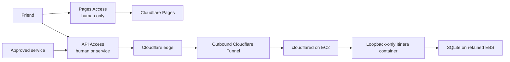

# ADR 0001: Run Itinera on one EC2 host with SQLite

- Status: Accepted
- Date: 2026-08-07
- Decision owners: Kaiyu Huang and the Itinera maintainers
- Supersedes: the Lambda, DynamoDB, CloudFront, and edge-Worker production design

## Context

Itinera is a small, friends-only application. Its first backend was designed for
AWS Lambda and one DynamoDB table to minimize idle cloud cost. The result is
operationally cheap but expensive to understand and change: every relational
invariant has to be rebuilt with physical keys, mirrored claims, metadata rows,
bounded aggregate validation, condition expressions, and large transactional
write descriptions.

That trade-off is no longer worthwhile. The expected workload fits comfortably
on one small host, planned downtime is acceptable, and no private production
environment or live DynamoDB data exists. We can therefore change the
persistence and deployment model without a live data migration or a dual-write
period.

The objective is the least complicated deployment that remains recoverable and
keeps the existing authorization, governance, audit, stale-write, and
idempotency rules intact.

## Decision

Itinera will run as one ARM64 container, managed directly by systemd on one
`t4g.micro` EC2 instance in one Availability Zone. It will use one SQLite
database on a dedicated encrypted gp3 EBS data volume.

The static React application remains on Cloudflare Pages behind a human-only
Cloudflare Access application. A separate API Access application admits those
humans plus explicitly named service callers. Both applications reference one
reusable human-admission Access group; only the API policy separately names
service and health-probe tokens. Direct or preview Pages hostnames are protected
or disabled. A remotely managed Cloudflare Tunnel is the only API ingress path:

The applications deliberately remain separate, so their cookies are separate
too. Cloudflare issues one application token per protected application/domain;
authenticating to Pages does not by itself put the API application's
`CF_Authorization` cookie on an API request. A fresh browser therefore uses this
explicit bootstrap before its first API fetch:

1. Pages performs its normal human Access login, then makes a top-level browser
   navigation—not `fetch`—to the fixed API `/session/bootstrap` URL.
2. API Access evaluates the shared human group and uses the existing global
   Access session when possible, so this normally sets the API-domain cookie
   without another credential prompt.
3. The origin verifies the exact API audience and human assertion, returns no
   private data, and sends `303 See Other` only to the configured production
   Pages root with a non-secret one-shot marker. It accepts no caller-provided
   return URL, path, or host; services and the probe are rejected.
4. Pages removes the marker, calls `/me` with `credentials: "include"`, and
   surfaces a terminal authentication error rather than looping if that call
   still fails. An expired API session repeats this flow at most once.

The two production hostnames are under the same registrable site, and the API
Access cookie is `Secure`, `HttpOnly`, and `SameSite=None` for the supported
cross-origin flow. Cloudflare answers unauthenticated browser `OPTIONS`
preflights at the edge from an exact, generated allowlist of the one Pages
origin, OpenAPI methods, and required headers; preflight never reaches the
origin. The credentialed request still reaches Rust and must pass JWT,
authorization, exact-origin CORS, and mutation CSRF checks. This follows
[Cloudflare's application-cookie and CORS model](https://developers.cloudflare.com/cloudflare-one/access-controls/applications/http-apps/authorization-cookie/cors/)
without restoring the Worker bridge. The frontend/runtime cutover adds the
bootstrap route and its OpenAPI/contract coverage together; this documentation
decision does not claim that the future restored runtime implements it yet.

Logout is also an Access operation, not a frontend state toggle. The logout
control first synchronously purges all private in-memory/query state and every
approved browser cache, then top-level-navigates to the one configured team
domain at `https://<team>.cloudflareaccess.com/cdn-cgi/access/logout`. The URL
and team domain come only from private deployment configuration; no caller may
supply a return URL, host, or path, and the app does not automatically redirect
back. This clears the global-session cookie and revokes the user's sessions
across the Pages and API applications. Domain-scoped `HttpOnly` cookie bytes may
remain until expiry, but Cloudflare no longer accepts their tokens after its
documented 20–30 second propagation interval. The UI stays off private screens
during that interval and never calls bootstrap as part of logout. Clean-browser
tests purge state, follow the fixed logout navigation, wait the provider window,
then prove both Pages and API require authentication and that the old API token
is rejected. This is the supported behavior described by
[Cloudflare session management](https://developers.cloudflare.com/cloudflare-one/access-controls/access-settings/session-management/#log-out-as-a-user),
not an instant-revocation claim.

The target deliberately does **not** use ECS, an ALB, API Gateway, CloudFront,
the TypeScript edge Worker, Lambda, DynamoDB, a NAT gateway, a public IPv4
address, SSH, or any inbound security-group rule.

### Selected components

| Concern             | Decision                                                                                                                |
| ------------------- | ----------------------------------------------------------------------------------------------------------------------- |
| Compute             | One ARM64 `t4g.micro`, T CPU credits in `standard` mode                                                                 |
| Process model       | Host systemd manages Docker and one digest-pinned app container; host systemd also manages `cloudflared`                |
| Database            | One SQLite file in WAL mode, one domain-mutating app process, bounded pool, bundled patched SQLite ≥ 3.51.3             |
| Durable disk        | 12 GiB disposable root plus 8 GiB retained ext4 gp3 data volume initially; both encrypted with the AWS-managed EBS key  |
| Static frontend     | Cloudflare Pages behind a human-only Access app using the shared human-admission group                                  |
| API ingress         | A separate Access app using that group plus named services; explicit browser session bootstrap; remotely managed Tunnel |
| Host administration | AWS Systems Manager only; no SSH listener or key pair                                                                   |
| Public networking   | Stable public IPv6 egress through an egress-only internet gateway; no public IPv4                                       |
| Images              | Private ECR repository, ARM64 images addressed by digest                                                                |
| Backups             | Daily SQLite online backup to a private versioned S3 bucket                                                             |
| Infrastructure      | Public Terraform child module; private root owns real values and deployment                                             |

This is a single-node design, not a small high-availability cluster. The
database file is never placed on EFS, NFS, or another network filesystem: WAL
mode requires every database user to be on the same host.

## Network and request boundary

The instance keeps its required private IPv4 address inside the VPC but has no
IPv4 default route, NAT, Elastic IP, or auto-assigned public IPv4. A separately
managed ENI retains a primary globally routable IPv6 address for the host and
one AWS-delegated `/80` IPv6 prefix for containers. The subnet's `::/0` route
points to an egress-only internet gateway, which permits connections initiated
by the host and prevents internet-initiated IPv6 connections. The security
group has zero ingress rules.

`cloudflared` initiates the tunnel over IPv6 and proxies only to
`http://127.0.0.1:3000`. Every route on that origin listener sits behind API
Access-assertion verification. Its narrow `GET /healthz` exception accepts only
a cryptographically valid service assertion for the exact API audience whose
`common_name` constant-time matches the separately configured probe digest. It
rejects humans and normally mapped services, resolves no domain mapping, and
reads no private data; every other route performs normal principal, scope/quota,
and membership checks. A root-only, non-domain health-probe Access credential
lets the deploy unit exercise that path but grants no application operation.

Docker separately publishes a readiness-only listener at
`http://127.0.0.1:3001`; it is absent from Tunnel configuration and exposes only
local liveness/readiness. Readiness checks the exact schema, SQLite source, and a
database read. The current combined unauthenticated `/healthz` route is
transitional and must be split at runtime cutover. Both ports are host-loopback
only. The IPv6-enabled Docker bridge assigns the app one fixed address from the
delegated prefix, so the container can reach IPv6 dependencies without host
network mode or NAT66. Zero security-group ingress still makes that address
unreachable from the VPC or internet. The tunnel does not require a stable
source address; the retained ENI and prefix preserve a stable container source
for provider allowlists such as a future Google server key.

The deployment must force and preflight IPv6 for every required dependency:

- Cloudflare Tunnel edges and Access JWKS;
- Systems Manager and its message endpoints;
- ECR API and registry dual-stack endpoints;
- the S3 dual-stack endpoint used for backups and patch artifacts;
- CloudWatch metrics/logs and any host-called notification endpoint used for
  disk, instance, or backup alarms;
- the operating-system package repositories; and
- Google, Frankfurter, R2, and any later runtime provider.

Both TCP and UDP port 7844 are permitted for Tunnel transport, HTTPS egress is
permitted, and ICMPv6 required for neighbour discovery and path-MTU discovery is
not blocked. Host bootstrap requires SSM Agent 3.3270.0 or later, sets
`UseDualStackEndpoint=true`, restarts it, and fails if either assertion is false.
Before app/data activation, the node must register as managed over IPv6 and pass
a real read-only Run Command plus patch-source connectivity check; otherwise the
disposable instance is replaced with a corrected image. ECR pulls use
`ecr.<region>.api.aws` and `<account>.dkr-ecr.<region>.on.aws`; S3 clients use a
dual-stack regional endpoint.

If a required dependency is IPv4-only, deployment stops. The explicit fallback
is one charged public IPv4 on the same zero-ingress host, subject to review; it
is never a NAT gateway silently added for convenience.

## Host and container boundary

Amazon Linux 2023 is rebuilt from code rather than treated as a pet server.
There is no SSH daemon exposed and no EC2 key pair. SSM provides audited
maintenance access. IMDSv2 is required with response hop limit 1: host tools can
obtain the instance role, while the bridged app container cannot.

The application container:

- runs as a fixed non-root UID/GID matching ownership of the data directory;
- has a read-only root filesystem, a small tmpfs for temporary files,
  `no-new-privileges`, and all Linux capabilities dropped;
- receives only the data-directory bind mount and narrowly scoped secret files;
- never receives the Docker socket or the host instance-role credentials; and
- handles SIGTERM, stops accepting work, finishes bounded requests, closes the
  SQLite pool, and exits within the systemd stop timeout.

Backup, migration, and restore-validation one-shots use the same reviewed image
but a stricter maintenance profile: fixed non-root UID, read-only root,
`no-new-privileges`, all capabilities dropped, bounded tmpfs/resources, and
`--network none`. Backup receives only a read-only source plus one writable
journal-owned staging directory; migration receives only the proposed
generation; restore validation receives only the staged generation in read-only
mode. None receives the Docker socket, host credentials, application/provider
secrets, or unrelated data generations. The host performs ECR and S3 traffic.
Tests prove every maintenance container cannot reach either IMDS address or an
internet listener and cannot write outside its exact destination mount.

`cloudflared` also runs without host privilege: a dedicated system user has no
shell or home, no Linux capabilities, and access only to its systemd credential
and read-only configuration. Its unit uses `NoNewPrivileges`, a read-only
system view, private temporary/device namespaces, kernel/control-group
protection, and a restricted address-family set. It cannot read the database,
application secrets, or Docker socket. A per-unit cgroup/UID firewall denies
both `169.254.169.254/32` and `fd00:ec2::254/128`; a negative test includes the
IMDSv2 token `PUT`, so its required IPv4/IPv6 internet access cannot also reach
instance-role credentials.

The host installs a reviewed, checksum-pinned `cloudflared` release at version
2025.4.0 or later (required for `--token-file`). Preflight asserts the exact
version and starts it with `--token-file`, `--edge-ip-version 6`, and
`--no-autoupdate`; the default autonomous 24-hour updater is not allowed.
Upgrades are explicit maintenance-lock operations followed by local and
external tunnel health checks.

Resource isolation preserves enough of the 1 GiB host for the kernel, Docker,
SSM, and recovery tools. The initial load-test budget is 512 MiB/no extra swap,
1.25 vCPU, 128 PIDs, and 4,096 file descriptors for the app container; 128 MiB,
0.25 vCPU, 64 tasks, and 4,096 descriptors for `cloudflared`; and 128 MiB plus
0.25 vCPU for a backup one-shot. Docker cgroup flags enforce container limits,
while systemd applies unit limits and bounded start/stop runtimes. The host-ops
PR must measure and tune these on ARM64 while preserving at least 256 MiB and
0.25 vCPU for host control. Deployment load/OOM tests must show that exhausting
the app kills/restarts it without taking down SSM, `cloudflared`, or backup
recovery. Host memory/OOM and disk alarms are required; private-environment
creation is blocked until the measurements pass.

The app uses the dedicated bridged network, never Docker host networking. That
extra network hop and IMDSv2 response hop limit 1 are tested together so an app
container cannot obtain host credentials. Docker's IPv6 route is configured
from the ENI-delegated prefix; deployment tests prove its selected address and
outbound source rather than relying on an implicit IPv4 fallback.
Host firewall rules also deny that bridge both the IPv4 and IPv6 IMDS endpoints;
the hop limit is defence in depth, not the only credential boundary.

The EBS filesystem is mounted by UUID with `nodev,nosuid,noexec`. The app unit
uses `RequiresMountsFor=` and fails closed if the expected volume or database
directory is absent. The volume, backup bucket, and retained ENI are protected
against ordinary Terraform destruction. The disposable root volume may be
recreated with the instance. Disk alarms fire before either initial volume is
full; expansion is an explicit operational change and does not require a new
database format.

The 12 GiB root volume also has a bounded image-cache contract. CI rejects an
application image above 1 GiB unpacked. Before every deploy, restore, or boot-
recovery pull, one host image-management helper inventories the running digest,
the current generation, any journal-required pre-ingress fallback, local app
layers, and root free space, then proves the pull can preserve a 3 GiB root
reserve. Under the maintenance lock it may remove only explicitly enumerated
Itinera digests/layers that are not running and are not named by those protected
generations; backup-only digests remain recoverable from ECR. It keeps at most
the current and one previous release locally, never uses an unscoped
`docker system prune`, and verifies the reserve again after an interrupted or
successful pull. If safe cleanup cannot prove enough space, the operation stops
and the disposable host/root volume is rebuilt. Repeated-deploy, restore,
boot-recovery, interrupted-pull, and cleanup tests prove the
running/current/fallback images and SSM control path survive.

Host security packages, Docker, and `cloudflared` follow a documented patch
timer. A maintenance reboot is allowed to stop the single node, and the app
must return to readiness automatically afterward. Image and host patch age are
monitored; unattended upgrades must not perform an unbounded surprise reboot.

Tunnel and application secrets do not appear in Terraform state, EC2 user data,
Docker image layers, container environment listings, command history, or logs.
The private deployment installs them as root-owned files or systemd credentials;
`cloudflared` reads its token with `--token-file`. The public repository contains
only templates and required variable names.

## Persistence boundary

[`../SQLITE.md`](../SQLITE.md) is the physical persistence contract. The key
rules are:

- every connection enables `foreign_keys`, a busy timeout, WAL, and
  `synchronous = FULL`;
- the image statically bundles the Cargo.lock-pinned SQLite engine at version
  3.51.3 or later and readiness rejects a vulnerable or unexpected build;
- only one long-running, domain-mutating Itinera API process opens the database;
  the sole concurrent-process exception is the bounded read-only-source backup
  command, while migrations and restores require the API to be stopped;
- each trip-owned mutation starts `BEGIN IMMEDIATE`, reads the direct membership
  row and required role inside that transaction, then performs all state, audit,
  and idempotency writes before one commit; app-scoped provisioning and
  owner-scoped commands use the explicit verified-principal recipes in the
  SQLite contract;
- reads that combine authorization and private data use one read transaction;
- trip ownership is represented by composite keys and foreign keys, not by
  globally loading a child and inferring its trip;
- unique constraints replace claim records, foreign keys replace mirrored
  pointers where possible, and derived counts are queried rather than stored;
- revisions and exact-value predicates remain where the API promises
  stale-state protection; SQLite's single writer is not permission to weaken
  optimistic concurrency; and
- JSON is reserved for bounded value objects, ChangeSets, and immutable audit
  snapshots. Authorization, ownership, lifecycle, uniqueness, and references
  are relational columns.

Repository capabilities remain separate Rust modules. A shared `SqliteDb` owns
the pool, migrations, and small mechanical helpers; it does not become a new
all-purpose repository.

## Migration and cutover

There is no production data migration in this decision. The private environment
has deliberately not been created. If live or irreplaceable DynamoDB data
appears before cutover, work must stop for a separately reviewed export,
validation, reconciliation, and rollback design.

The code migration proceeds without runtime dual writes:

1. Accept this ADR and the SQLite schema/invariant contract.
2. Archive and remove the undeployed DynamoDB/Lambda backend so domain and
   repository contracts can evolve without maintaining a second provider.
3. Establish validated domain values and aggregate construction before
   persistence codecs.
4. Add `SqliteDb`, versioned migrations, connection configuration, and
   temp-file integration tests.
5. Evolve API/application/repository ports to carry a human-or-service
   authorization context through each trip operation and to compose related
   reads in one transaction; do not discard a service ID or open a second
   repository snapshot before the SQLite boundary.
6. Port repositories in independently reviewable capability slices. Each slice
   runs its repository contract against a real temporary SQLite file. Reach
   full parity for users; trips/membership/invites; candidates/plans;
   history/revert; proposals/polls; discussions; ledger/notices; and service
   identities.
7. Restore runtime startup with SQLite only and add container, readiness, and
   shutdown support.
8. Add host systemd, deploy, backup, restore, and patching artifacts.
9. Replace the public Terraform module with the EC2/EBS/IPv6/SSM/ECR/S3 design.
10. Only after SQLite runtime and infrastructure tests pass, remove the frozen
   CloudFront and edge-Worker code and dependencies.

No private environment is created during these steps. Environment creation
remains a later, explicit production gate.

## Deploy and rollback

The private deployment workflow checks out a reviewed commit, builds and tests
one ARM64 image, and uses short-lived GitHub OIDC credentials to push it to ECR.
Public CI needs no deployment credential. Deployment selects an immutable
digest, never a mutable tag. SSM starts a host systemd one-shot rather than an
unrecoverable remote shell sequence. The one-shot:

1. verifies the data and root volumes, image-size ceiling, protected local
   digests/layers, root reserve, and the conservative full deploy peak on EBS;
2. acquires the shared host-maintenance lock, removes only
   proven-unreferenced Itinera image data if required, pulls the
   selected digest through ECR's IPv6 endpoint, and rechecks the root reserve;
3. writes and `fsync`s a root-only phase record on the data volume with the old
   generation/image, proposed new generation/image, and
   `ingress_closed=false`, then stops `cloudflared`, waits for its connections
   to close, gracefully stops the app, and confirms that every SQLite
   connection has closed;
4. runs the backup command from the current generation's manifest-selected
   image/SQLite build against that quiescent rollback point, checks it, uploads
   it with a checksum, confirms the S3 object, and retains the exact
   journal-owned stage until the new generation is installed; using the exact
   snapshot size, it repeats the full EBS peak proof before proceeding;
5. installs that verified standalone snapshot into a new generation, removes
   and `fsync`s only the consumed stage, runs versioned migrations in the new
   generation, validates the final schema/integrity/foreign keys, then atomically
   writes, renames, and `fsync`s a host-only generation manifest binding the new
   database schema, SQLite source, and image digest;
6. atomically switches and `fsync`s `current` to the complete new generation,
   journals that selection, and starts its manifest-selected digest while
   external ingress remains closed;
7. calls the non-Tunnel readiness listener on port 3001 to validate the exact
   expected schema and SQLite build and execute a database read, then records
   and `fsync`s a `ready_to_open` phase while ingress is still closed; and
8. starts `cloudflared`, uses the root-only health-probe Access credential to
   require a `204` from the assertion-protected, no-data `/healthz` on the API
   hostname, then records completion, clears the journal, and releases the lock
   so timers may acquire it normally.

Before each irreversible phase, the journal records the backup object/hash,
schema identity, migration start, new-manifest installation, and `current`
selection. App and `cloudflared` units are conditioned on the boot recovery unit
while that marker is incomplete. On SSM loss, process kill, or reboot, recovery
resumes under the same lock and either discards the incomplete new generation
and reselects the intact old generation plus its manifest-selected image, or --
once `ready_to_open` is durable -- finishes opening the already-accepted new
deployment without restoring older data. Fault-injection tests terminate or
reboot before and after manifest rename, symlink selection, readiness, and the
Tunnel-start window and prove the process is resumable.

Short downtime is intentional. If failure occurs before migration begins, the
host can restart the previous digest against the unchanged database. Once the
migration command begins, every failed migration or startup reselects the
unchanged old generation and its previous digest; if that generation fails
validation, recovery reconstructs it from the verified quiescent pre-deploy
backup. The old app must pass loopback readiness before `cloudflared` restarts.
After external ingress has reopened, automation never selects an older
generation or snapshot; any later rollback first closes ingress and requires a
new recovery decision so acknowledged writes are not silently discarded.

Migrations are forward-only, versioned SQL committed with the code. They run
under the host-maintenance lock, in a transaction where SQLite permits it, and
never inside an HTTP request or implicitly during normal application startup.
Each image validates its exact migration checksum and schema version and fails
closed. Migration touches only the staged new generation; rollback selects the
unchanged prior generation and its manifest-selected image, or reconstructs it
from the matching backup, instead of guessing that an older image can write a
newer schema.

## Backup and recovery

The primary backup is produced with SQLite's Online Backup API, not by copying a
live `.db`, `-wal`, or `-shm` file. A bounded one-shot command always runs from
the source generation's manifest-selected current image and SQLite build, even
when a proposed deployment image has already been pulled. It opens the source
only for backup; it is not a second API writer. Each daily job:

1. writes a snapshot to a temporary file on the data volume and `fsync`s the
   file and containing staging directory;
2. requires `PRAGMA integrity_check` to return `ok` and
   `PRAGMA foreign_key_check` to return no rows on the snapshot;
3. computes a SHA-256 checksum and records the backup format, source generation,
   UTC time, byte size, and the source manifest's exact schema version/checksum,
   app image digest, and SQLite version/source ID in the backup manifest;
4. uploads the snapshot and manifest to a private, public-access-blocked,
   versioned S3 bucket using SSE-S3; and
5. sends an alert on any failure or when the latest successful backup is stale.

The job owns one unique, journaled staging directory. After S3 confirms both
object versions/checksums, it removes only that stage and `fsync`s the staging
parent. Failure and boot recovery clean the exact journal-named incomplete
stage before another run. The maintenance lock and size bound permit at most one
local backup stage, so daily snapshots cannot accumulate on EBS.

The job starts only with enough free space for the live database, WAL, snapshot,
and a 1 GiB data-volume safety margin. It has a duration limit so a stuck backup
cannot pin WAL growth indefinitely. ECR garbage collection retains the current
and validated fallback generation digests plus every digest referenced by the
backup retention window. Immutable release tags may act as retention roots, but
hosts still select images only by digest.

Deploy has a separate, larger peak-space proof. Before it closes ingress, and
again after the quiescent snapshot reveals its exact size but before it installs
or migrates the new generation, it reserves all of:

- the complete current generation, including database/WAL/SHM;
- every retained non-current generation that is not eligible for safe cleanup;
- the journal-owned standalone pre-deploy snapshot;
- a complete new generation at snapshot size plus the migration's CI-measured,
  manifest-declared maximum growth, rebuild scratch, and WAL allowance; and
- the operation journal/manifests plus the 1 GiB data-volume safety margin.

Under the maintenance lock, the host may remove an excess non-current generation
before ingress closes only when it is neither current nor the operation fallback
and a verified off-instance backup exists. If either proof fails, deploy removes
only its incomplete stage, leaves/reselects the current generation, and stops
for EBS expansion instead of starting migration. Tests exercise exact free-space
boundaries, migration growth, retained quarantine, and the second post-snapshot
check.

The volume stores immutable-named generation roots and a root-owned `current`
symlink. Each root has a host-only manifest binding its writable `db/` child to
the exact app image/schema/SQLite source; the container receives only that
child, so selecting `current` selects compatible DB and image together. Restore
stops ingress and every database process, stages and verifies a new generation,
`fsync`s its database, manifest, and directories, atomically renames a temporary
symlink over `current`, then `fsync`s the parent directory. The old generation
remains an intact quarantine, including any WAL sidecars, so it cannot mix with
the restored file and a crash leaves `current` durably naming either the
complete old or complete new generation. Boot and power-loss fault tests verify
that invariant before app startup.

Recovery runs the exact image and schema recorded in the backup manifest and
does not migrate the restored bytes. Any upgrade happens later through the
normal deploy workflow, which first takes a new quiescent rollback backup.
Before restore or boot recovery pulls an absent manifest-selected image, the
same host image-management helper runs under the maintenance lock, protects the
running/current/journal-fallback digests, proves the 1 GiB image ceiling and
3 GiB root reserve, and performs only scoped cleanup. An interrupted pull is
reconciled before retry. If the proof fails, app and Tunnel remain closed for
disposable-host/root replacement; recovery never consumes SSM's reserve.

Restore uses the same durable operation-journal discipline: it records the old
target and whether it is a validated fallback, then records stage, promotion,
image-open, readiness, and `ready_to_open` phases. Before `ready_to_open`,
failure/reboot either resumes deterministically or atomically repoints `current`
to that validated old generation and its manifest-selected image; without a
valid fallback, services remain closed for an explicit backup choice. After
`ready_to_open`, recovery only completes Tunnel startup/external health and
never restores older data that could omit accepted writes. The journal clears
only after that health check. Fault injection covers image open, readiness, and
Tunnel-start windows, not only file operations.

Before stopping ingress or staging large bytes, restore fetches the small backup
manifest, journals `ingress_closed=false`, and proves both volumes. The EBS peak
includes the complete current database/WAL/SHM, every retained non-current
generation not safely removable, the complete restored generation at manifest
size plus filesystem allowance, operation metadata, and the 1 GiB data-volume
margin. The root proof uses the protected-digest policy above. Under the lock it
removes enough excess non-current generations before outage to keep no more than
two after the current becomes quarantine, but only when each has a verified
off-instance backup and is neither current nor an operation fallback. It then
pulls any absent compatible image, closes ingress/app, records that phase,
downloads/stages the snapshot, and repeats both proofs using actual allocated
bytes before promotion.

A failure before promotion removes only its incomplete staged generation and
can resume the still-current service; a journaled failure after promotion can
select the intact prior generation while ingress is closed. Cleanup never
deletes the current target or the only verified recovery copy. If either space
proof or cleanup precondition fails, recovery stops before mutation for root/EBS
replacement or expansion rather than filling a filesystem. Disk alarms cover
root layers, staging, and quarantine bytes.

Deploy, migration, daily backup, restore, host patch, and reboot units all use
one host-maintenance lock. Their systemd ordering/conflict rules prevent a timer
from opening SQLite or replacing files while another maintenance operation is
active. Timers remain enabled: an activation that cannot acquire the lock exits
or retries by policy and never stops the lock holder. Unit-finally and boot
reconciliation release stale process state on every exit without requiring a
deploy journal to re-enable scheduling. Race and fault tests cover timer starts,
kill, and reboot before and after the first durable phase record.

The instance role has the SSM managed-node control/data-channel, association,
inventory, and compliance-reporting permissions needed for audited maintenance,
including the `ssmmessages` control/data channels; legacy regional
`ec2messages` permissions are included only where the selected SSM endpoint
requires them. Separately, it can pull only
the application image, read and write the exact backup prefix, read exact
runtime parameters, and publish the required alert or metrics. It cannot push
images, delete backups, or administer the bucket.
The separate private deploy role may invoke only the reviewed SSM documents on
the exact instance and read their command result; it does not inherit the
instance profile or unrestricted Session Manager/`SendCommand` access.
Lifecycle policy, not the instance, expires backups. Daily backups are retained
for at least 35 days. EBS snapshots may be added as a second-line recovery aid,
but a raw snapshot is not the only backup format.

The initial recovery objectives are RPO 24 hours and RTO 4 hours. A retained
same-AZ EBS volume supports quick instance replacement. Loss of the volume or
Availability Zone requires a new volume and restore from S3. A restore drill is
performed before launch and at least quarterly thereafter on a separate,
temporary encrypted scratch volume. An isolated loopback-only, read-only-source
container receives no Tunnel route, production secret, or write authority and
verifies the manifest, checksum, integrity/foreign keys, migration state,
representative row counts, and trip-scoped reads; the scratch volume is then
destroyed. Its short-lived storage is included as negligible drill usage in the
budget. Promoting a backup into `current` happens only during real recovery,
after ingress closure and an explicit recovery decision, never as the drill.

## Availability and scaling consequences

Accepted disadvantages:

- instance, Availability Zone, host patching, filesystem, or database failure
  causes downtime;
- writes are serialized by SQLite;
- deploys and non-online schema migrations briefly stop the app;
- a restore can lose up to one day of changes; and
- host patching, disk monitoring, backups, and restore drills are now our job.

These are appropriate for a small friend group whose downtime is not critical.
The design must be revisited before adding a second app node, sustained write
load, a tighter RPO/RTO, or availability commitments. Copying the SQLite file to
a shared filesystem is not a scaling path; the next step would be a managed
relational database and an explicit migration.

## Cost consequence

The expected paid baseline is one `t4g.micro`, small root and data gp3 volumes,
small ECR/S3 storage, and a few alarms. Cloudflare Pages, Tunnel, and Access are
expected to remain within their free plans at friend-group scale. There is no
public IPv4 hourly charge and no NAT, ALB, ECS, Lambda, DynamoDB, or CloudFront
line item.

For planning, budget roughly **USD 8-12 per month before tax**, plus the domain,
provider API usage, and any data transfer beyond free allowances. This is an
estimate, not a price guarantee; the private deployment must use the AWS Pricing
Calculator for its chosen Region before creation. T4g uses `standard` CPU credit
mode so a burst becomes throttling rather than an unlimited-credit surprise.

## Alternatives considered

- **Keep Lambda and DynamoDB:** lowest idle compute bill, but retains the code
  and maintenance complexity that motivated this decision.
- **ECS on EC2:** adds an agent, task definitions, and another control plane but
  provides little value for one fixed host and one process. Direct systemd is
  simpler.
- **RDS or another managed SQL service:** easier database operations and a
  future multi-node path, but a much higher permanent baseline for this scale.
- **PostgreSQL on the same EC2 host:** capable, but adds another daemon,
  credentials, tuning, and backup format without a current need for networked
  database access.
- **Public IPv4 ingress with Caddy/nginx:** workable, but adds an address charge,
  inbound firewall/TLS exposure, and certificate operations. Tunnel keeps the
  host outbound-only.
- **NAT gateway for IPv4 egress:** operationally simple but disproportionately
  expensive. If IPv6 compatibility fails, one reviewed public IPv4 is the
  simpler fallback.
- **SQLite on EFS:** rejected because WAL is not a network-filesystem design and
  EFS adds cost and failure modes.

## References

- [Cloudflare Tunnel overview](https://developers.cloudflare.com/tunnel/)
- [Cloudflare Tunnel run parameters and token files](https://developers.cloudflare.com/tunnel/advanced/run-parameters/)
- [AWS egress-only internet gateway](https://docs.aws.amazon.com/vpc/latest/userguide/egress-only-internet-gateway.html)
- [Systems Manager in an IPv6-only environment](https://docs.aws.amazon.com/systems-manager/latest/userguide/patch-manager-server-patching-iPv6-tutorial.html)
- [Amazon ECR dual-stack endpoints](https://docs.aws.amazon.com/AmazonECR/latest/userguide/ecr-requests.html)
- [EC2 prefix delegation for container networking](https://docs.aws.amazon.com/AWSEC2/latest/UserGuide/ec2-prefix-eni.html)
- [SQLite write-ahead logging](https://www.sqlite.org/wal.html)
- [SQLite WAL-reset bug and fixed versions](https://www.sqlite.org/wal.html#the_wal_reset_bug)
- [SQLite Online Backup API](https://www.sqlite.org/backup.html)
- [Amazon EBS volume retention](https://docs.aws.amazon.com/AWSEC2/latest/UserGuide/preserving-volumes-on-termination.html)
- [Amazon EC2 On-Demand pricing](https://aws.amazon.com/ec2/pricing/on-demand/)
- [Amazon EBS pricing](https://aws.amazon.com/ebs/pricing/)
- [Cloudflare plan pricing](https://www.cloudflare.com/plans/)
